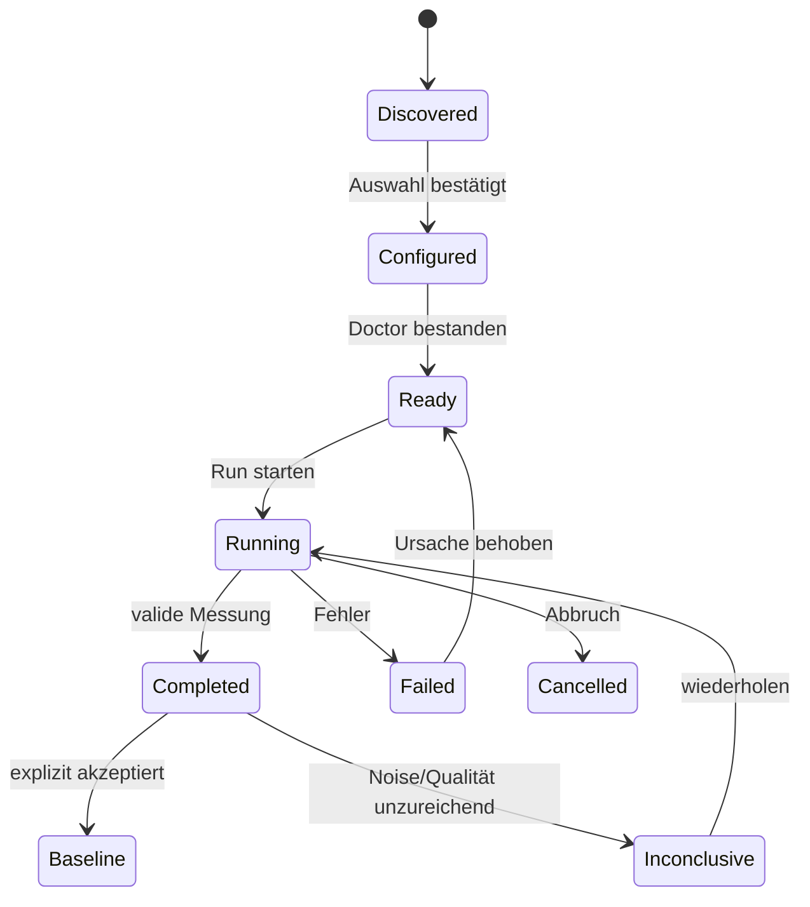
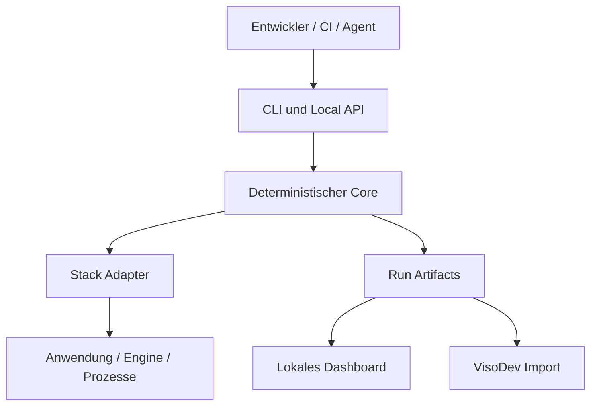
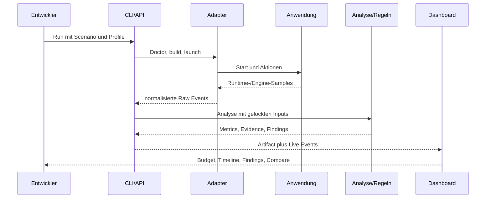

# Product Requirements Document: Potato Boost

<!-- prd-section:document-control -->
## 0. Dokumentkontrolle

| Feld | Wert |
|---|---|
| Status | Draft |
| Implementation readiness | READY WITH ASSUMPTIONS |
| Version | 0.2 |
| Letzte Aktualisierung | 2026-08-12 |
| Product Owner | Ben |
| Technical Owner | `[UNKNOWN]` |
| Zielrelease | `[UNKNOWN]` |
| Evidence cutoff | Gespräch und Quellen bis 2026-08-12 |

### Änderungshistorie

| Version | Datum | Änderung | Quelle / Entscheidung |
|---|---|---|---|
| 0.1 | 2026-08-12 | Erstfassung mit User Journey, Dashboard, Adaptern und Tech-Stack | S-001 bis S-011 |
| 0.2 | 2026-08-12 | Formales PRD-Update: Responsive UX, Datenformate, Integration Failure Handling, Modulgrenzen, Event-Taxonomie und manuelle Prüfungen ergänzt; bestehende IDs beibehalten | Explizite Anwendung des Conversation-to-PRD-Workflows |

<!-- prd-section:source-ledger -->
## 1. Evidenz- und Quellenverzeichnis

| Source ID | Quelle | Evidenzzusammenfassung | Zuverlässigkeit | Betroffene Bereiche |
|---|---|---|---|---|
| S-001 | Gespräch: ursprüngliche Produktidee | Codebasen und laufende Anwendungen sollen auf Performance untersucht und für schwache Hardware optimierbar gemacht werden. | Direkt | Ziele, Scope |
| S-002 | Gespräch: deterministischer Kern | Messung, Heuristiken und Diagnose sollen ohne KI funktionieren; KI ist optionaler Enrichment-Layer. | Direkt | Verfassung, Architektur |
| S-003 | Gespräch: VisoDev-Abgrenzung | Potato Boost soll unabhängig von VisoDev als CLI mit lokalem Dashboard funktionieren und später Daten an VisoDev liefern. | Direkt | Scope, Schnittstellen |
| S-004 | Aktuelle Nutzeranfrage | Vollständige User Journey, Dashboard, automatische Projekterkennung, Templates, Stack- und Schnittstellenabdeckung werden benötigt. | Direkt | Journey, UX, Adapter |
| S-005 | [Starred-Prior-Art-Bericht](./potato-boost-starred-prior-art.md) | 214 Sterne wurden untersucht; Claude-of-Duty, shadscan, skott, Graphify, mindwalk, promptfoo, Playwright und mcp-server-tauri liefern passende Muster. | Abgeleitet | Architektur, Stack |
| S-006 | [npm exec](https://docs.npmjs.com/cli/v9/commands/npm-exec/?v=true) | `npx`/`npm exec` kann lokale oder remote npm-Pakete ausführen und sie bei Bedarf cachen. | Primärquelle | Distribution |
| S-007 | [Node.js Releases](https://nodejs.org/en/about/previous-releases) | Node 24 ist am 2026-08-12 LTS; Produktionsanwendungen sollen unterstützte LTS-Versionen verwenden. | Primärquelle | Stack |
| S-008 | [Chrome DevTools Protocol](https://chromedevtools.github.io/devtools-protocol/) und [Playwright Tracing](https://playwright.dev/docs/api/class-tracing) | CDP bietet Browser-Instrumentierung und Profiling-Domains; Playwright erfasst Browser-, Netzwerk- und Aktions-Traces. | Primärquelle | Web-Adapter |
| S-009 | [Godot Performance](https://docs.godotengine.org/en/stable/classes/class_performance.html) | Godot stellt FPS, Frame-/Physics-Zeit, Speicher, Objekte, Draw Calls, Rendering- und Pipeline-Compiler-Monitore sowie Custom Monitors bereit. | Primärquelle | Godot-Adapter |
| S-010 | [.NET dotnet-counters](https://learn.microsoft.com/en-us/dotnet/core/diagnostics/dotnet-counters) und [EventPipe](https://learn.microsoft.com/en-us/dotnet/core/diagnostics/eventpipe) | .NET stellt Prozess-Counter, JSON/CSV-Export und EventPipe-basierte Diagnose bereit. | Primärquelle | .NET-Adapter |
| S-011 | [Tauri WebDriver](https://v2.tauri.app/develop/tests/webdriver/) | Tauri dokumentiert WebDriver-Tests für Desktop-Anwendungen; native Tauri-Messung bleibt plattformspezifisch. | Primärquelle | Tauri-Adapter |
| S-012 | [W3C WCAG 2.2](https://www.w3.org/TR/2024/REC-WCAG22-20241212/) | WCAG 2.2 ist eine testbare W3C Recommendation für barrierefreie Webinhalte und bildet die Referenz für das lokale Dashboard. | Primärquelle | UX, Accessibility, Testing |

### Konflikte

Keine widersprüchlichen Kernanforderungen. Die gewünschte Vollautomatisierung steht lediglich in Spannung zur Notwendigkeit fachlich repräsentativer Szenarien. Dies wird durch Auto-Erkennung plus explizite Bestätigung gelöst.

<!-- prd-section:summary -->
## 2. Executive Summary

### Kontext

KI-generierte und schnell prototypisierte Web-, Desktop- und Spielanwendungen können funktional korrekt, aber unnötig CPU-, GPU-, RAM- oder netzwerkintensiv sein. Übliche Profiler liefern Rohdaten, verbinden sie jedoch selten mit einem reproduzierbaren Szenario, einem Zielgerät, einer deterministischen Diagnose und einem konkreten Quellbeleg.

### Problem

Ein Repository allein zeigt nicht, welche Codepfade unter realer Last problematisch werden. Ein einmaliger Lauf allein zeigt nicht, ob ein Wert reproduzierbar oder nur Messrauschen ist. Ein generischer Zielwert allein beweist nicht, dass eine Anwendung auf einem realen schwachen Gerät funktioniert.

### Vorgeschlagene Lösung

Potato Boost ist ein lokal ausgeführtes Entwicklerwerkzeug mit CLI und Browser-Dashboard. Es erkennt Projektarten automatisch, schlägt passende Adapter, Startbefehle, Szenarien, Collector und Zielprofile vor, lässt Unsicherheiten bestätigen und erzeugt reproduzierbare Runs. Jeder Befund enthält Messwert, Budget, Vergleich, Szenario, Quellbeleg, Regel-ID und Confidence.

### Wertversprechen

Der Nutzer erhält nicht nur „die Anwendung ist langsam“, sondern „dieses Szenario überschreitet auf diesem Zielprofil dieses Budget; die Messung korreliert mit diesen Laufzeitereignissen und diesen Quellstellen; diese Änderung ist verifizierbar“.

### Gewünschte Ergebnisse

| Goal ID | Ergebnis | Baseline | Target | Messfenster | Status / Quelle |
|---|---|---|---|---|---|
| G-001 | Erster verwertbarer Befund in einem unterstützten Projekt | Noch nicht vorhanden | ≤ 10 Minuten nach dem ersten Start | Onboarding-E2E-Test | `[PROPOSED]`; S-004 |
| G-002 | Reproduzierbare Vorher-/Nachher-Aussage | Noch nicht vorhanden | Drei gültige Wiederholungen und ausgewiesenes Noise-Budget | Je Compare-Run | `[PROPOSED]`; S-001, S-002 |
| G-003 | Erweiterbarkeit auf mehrere Stacks | Noch nicht vorhanden | Neuer Adapter ohne Änderung am Core-Schema | Adapter-Contract-Test | `[PROPOSED]`; S-003, S-004 |
| G-004 | Nachvollziehbare Befunde | Noch nicht vorhanden | 100 % der Findings besitzen Regel, Evidenz, Szenario und Confidence | Pro Release | `[PROPOSED]`; S-002 |
| G-005 | Lokale Datenhoheit | Noch nicht vorhanden | Kein Netzwerkzugriff im Offline-Modus | Pro E2E-Test | `[CONFIRMED]`; S-003 |

### Nicht-Ziele

- Potato Boost beweist ohne echten Hardware-Runner nicht, dass eine Anwendung auf einem bestimmten physischen Gerät läuft.
- Der MVP verändert keinen Produktivcode automatisch.
- Der MVP ersetzt keine vollständigen Engine-Profiler, APM-Produkte, Sentry oder OpenTelemetry.
- Der MVP baut keinen allgemeinen VisoDev-Codegraph nach.
- Der MVP unterstützt nicht gleichzeitig jede Engine und jede UI-Technologie.

<!-- prd-section:constitution -->
## 3. Produktverfassung und Grenzen

### Dauerhafte Prinzipien

1. Deterministische Messung und Regeln sind der Source of Truth; KI darf Ergebnisse erklären, priorisieren oder spätere Patches vorschlagen, aber keine Messwerte erzeugen.
2. Auto-Erkennung muss ihre Belege und Confidence anzeigen. Bei Mehrdeutigkeit entscheidet der Nutzer.
3. Ein Finding ohne reproduzierbares Szenario und Evidenz ist kein belastbarer Finding.
4. Zielprofil, Szenario, Adapter und Regelpaket bleiben getrennte, kombinierbare Verträge.
5. CLI, Dashboard, CI, Agenten und VisoDev lesen dasselbe versionierte Run-Artefakt.
6. Der Default ist read-only, lokal und offline-fähig.
7. Eine Hardware-Emulation muss als Approximation gekennzeichnet werden; nur ein realer Runner darf „hardware-validated“ ausgeben.

### Harte Grenzen

- `[CONFIRMED]` Potato Boost funktioniert ohne VisoDev.
- `[CONFIRMED]` Der Messkern benötigt keine KI.
- `[PROPOSED]` Der MVP wird als npm-Paket mit Node 24 LTS und TypeScript ausgeliefert.
- `[PROPOSED]` Der MVP unterstützt zuerst Web/Three.js, danach Godot; Tauri und .NET folgen als getrennte Adapter.
- Keine Abhängigkeit darf Projektdateien verändern, bevor der Nutzer eine konkrete Änderung bestätigt.

### Abhängigkeiten

- Node.js 24 LTS für CLI und Dashboard-Server.
- Browser-Binary für Web-Runs; Playwright verwaltet die kompatible Version.
- Installierte Engine bzw. Runtime für Godot, Tauri oder .NET.
- Betriebssystemrechte zum Starten und Beobachten lokaler Prozesse.

### Glossar

| Begriff | Definition | Quelle |
|---|---|---|
| Adapter | Stack-spezifische Implementierung für Erkennung, Start, Szenarien, Collector und Quellmapping. | `[PROPOSED]` |
| Collector | Liest rohe Messwerte aus OS, Browser, Runtime oder Engine. | `[PROPOSED]` |
| Scenario | Reproduzierbarer Ablauf mit Setup, Aktionen, Messfenster und Cleanup. | S-001 |
| Target Profile | Budgets und optional unterstützte Drosselung für eine Zielklasse. | S-004 |
| Hardware Runner | Reales Gerät oder VM mit erfasstem Hardware-/Software-Fingerprint. | `[PROPOSED]` |
| Rule Pack | Versionierte deterministische Regeln, Preconditions und Erklärungen. | S-002 |
| Finding | Regelverletzung mit Evidenz, Budget, Quellbezug und Confidence. | S-002 |
| Run Artifact | Unveränderliches, versioniertes Ergebnis eines Analyse-Runs. | S-003 |

<!-- prd-section:users -->
## 4. Nutzer, Akteure und Stakeholder

| Akteur / Rolle | Job to be done | Bedarf / Problem | Zugriffsgrenze | Erfolgssignal | Quelle |
|---|---|---|---|---|---|
| Solo-Entwickler | Lokale Anwendung analysieren und Regressionen verhindern | Profiler sind fragmentiert und schwer vergleichbar | Lokaler Rechner und Repository | Reproduzierbarer Finding mit Fix-Verifikation | S-001, S-004 |
| Game-Entwickler | Frame-Hitches, Speicher- und Renderingkosten lokalisieren | Durchschnitts-FPS versteckt Stutter und Szenarioeffekte | Spielprojekt und Engine | p95/p99, Hitches und Engine-Monitore sind erklärbar | S-001, S-009 |
| Web-/Tauri-Entwickler | Browser-, Bundle-, Startup- und Desktopkosten messen | Browser- und native Kosten werden vermischt | Webapp oder Desktop-App | Frontend- und Native-Modus werden getrennt ausgewiesen | S-004, S-008, S-011 |
| CI-System | Performancebudgets gegen Pull Requests prüfen | Manuelle lokale Tests verhindern keine Regression | Nur konfigurierter CI-Workspace | Stabiler Exit-Code und JSON-Report | S-005 |
| Coding-Agent | Befunde maschinenlesbar lesen und Verifikation starten | Terminaltext ist kein stabiler Vertrag | Freigegebene CLI-/API-Operationen | Versionierte Schemas und deterministische Befehle | S-003 |
| VisoDev | Performance-Evidenz visualisieren | Potato Boost soll keinen zweiten allgemeinen Codegraph bauen | Importierte Artefakte bzw. lokale API | Findings erscheinen auf VisoDev-Nodes | S-003 |

### Accessibility- und Inclusion-Bedarf

Das lokale Dashboard muss vollständig per Tastatur bedienbar sein, Status darf nicht allein durch Farbe kommuniziert werden, Tabellen und Charts benötigen Textalternativen und Animationen respektieren Reduced Motion.

### Stakeholder-Verantwortung

Ben verantwortet Produktziel und Scope. Technical Ownership, Rule-Pack-Review und Release Ownership sind `[UNKNOWN]`.

<!-- prd-section:scope -->
## 5. Scope und Release-Grenzen

### MVP

- npm-CLI und lokales Browser-Dashboard
- read-only Repository-Erkennung mit nachvollziehbarer Confidence
- Web-/Three.js-Adapter mit Playwright, CDP, In-Page- und OS-Collector
- Quick-Scan, geführte Aufzeichnung und skriptbare Szenarien
- Budgetprofile, Hardware-Fingerprints und Baselines
- Frame-Time-Verteilung, Hitches, JS Heap, Prozess-RSS/CPU, Netzwerk und verfügbare Renderer-Zähler
- statischer JS-/TS-Abhängigkeitskontext hinter Provider-Schnittstelle
- deterministische Regeln, Findings, Compare, HTML/JSON und CI-Exit-Codes
- lokaler, loopback-only Dashboard-Server

### Folgereleases

1. Godot-Adapter für GDScript und C# mit entfernbarer Instrumentation.
2. Tauri-Adapter mit Frontend- und Native-Modus.
3. .NET-Adapter für ASP.NET und Console/Worker; WPF/WinUI nur Windows.
4. Electron-, Unity-, JVM- und mobile Adapter.
5. MCP-Server und VisoDev-Import.
6. optionale deterministische Codemods und KI-gestützte Patch-Vorschläge.
7. Remote-/Hardware-Runner-Farm.

### Explizit außerhalb des MVP

- automatische autonome Codeänderungen
- Cloudkonto, Teamverwaltung und SaaS-Backend
- echte GPU-/RAM-Emulation beliebiger Hardware
- Production-APM und Error Tracking
- generischer Multi-Language-Knowledge-Graph

### Scope-Annahmen

- A-001: Der erste Benchmark ist eine Web-/Three.js-Anwendung; der Adaptervertrag wird vor Godot stabilisiert.
- A-002: Nutzer akzeptieren Node als MVP-Voraussetzung, auch bei Godot- und .NET-Projekten.
- A-003: Lokale, versionierbare Dateien sind im MVP wichtiger als eine zentrale Datenbank.

<!-- prd-section:journeys -->
## 6. User Journeys und Prozessabläufe

### Journey J-001: Erster Start und Projekterkennung

| Schritt | Akteur | Trigger / Aktion | Touchpoint | Systemzustand und Daten | Fehler / Recovery | Analytics |
|---:|---|---|---|---|---|---|
| 1 | Entwickler | Führt `npx @potato-boost/cli@latest` im Repository aus oder übergibt einen Pfad | Terminal | CLI löst Version auf und startet read-only Discovery | Fehlendes Node/keine Leserechte: konkrete Doctor-Meldung | lokal `cli_started` |
| 2 | System | Durchsucht Manifest- und Markerdateien | Terminal-Progress | Kandidaten wie Web, Three.js, Godot, Tauri oder .NET mit Evidenz und Confidence | Große Repos: ignorierte Pfade und Fortschritt anzeigen | `detection_completed` |
| 3 | Entwickler | Prüft Erkennung | Browser-Dashboard öffnet auf localhost | Karte zeigt „React + Vite + Three.js, 96 %“, Belege und Startbefehle | Mehrdeutig: Kandidaten nebeneinander; manuelle Wahl | `detection_confirmed` |
| 4 | Entwickler | Bestätigt oder korrigiert | Setup Wizard | Auswahl wird in `potato.config.yaml` gespeichert | Abbrechen verändert keine Projektdatei | `setup_saved` |
| 5 | System | Führt Doctor aus | Setup Wizard | Browser/Runtime/Engine, Build- und Startbefehle werden geprüft | Fehlende Abhängigkeit: genaue Installations- oder Pfadangabe | `doctor_completed` |

### Journey J-002: Erster Quick Scan

| Schritt | Akteur | Trigger / Aktion | Touchpoint | Systemzustand und Daten | Fehler / Recovery | Analytics |
|---:|---|---|---|---|---|---|---|
| 1 | Entwickler | Wählt „Quick Scan“ | Dashboard / Run Setup | Empfohlenes Scenario, Target Profile und Rule Pack sind vorausgewählt | Alles bleibt editierbar | `run_setup_opened` |
| 2 | Entwickler | Wählt Zielmodus | Target Selector | „Budgets auf diesem Rechner“, „unterstützte Drosselung“ oder „echter Runner“ | Unmögliche Emulation wird nicht als Hardwarebeweis angeboten | `target_selected` |
| 3 | System | Startet Build und App | Live Run | Phasen: prepare, warm-up, measure × N, analyze, report | Buildfehler: Log, Befehl und Retry; kein halber Baseline-Run | `run_phase_changed` |
| 4 | System | Führt Smoke-Aktionen aus | Laufende App plus Dashboard | Collector schreiben zeitgestempelte Samples und Markierungen | App-Crash: Run wird `failed`, Teilartefakte bleiben diagnostisch | `run_finished` |
| 5 | Entwickler | Öffnet Ergebnis | Run Overview | Budgets, Regressionen, Datenqualität und Findings erscheinen | Zu viel Noise: Ergebnis `inconclusive` statt Pass/Fail | `run_viewed` |

### Journey J-003: Repräsentatives Szenario erstellen

| Schritt | Akteur | Trigger / Aktion | Touchpoint | Systemzustand und Daten | Fehler / Recovery | Analytics |
|---:|---|---|---|---|---|---|---|
| 1 | Entwickler | Klickt „Scenario erstellen“ | Scenario Studio | Auswahl: Record, Vorlage, vorhandener Test, Code/YAML | Nicht unterstützter Recorder: Script-Vorlage | `scenario_create_started` |
| 2 | Entwickler | Führt Ablauf aus | App plus Recording-Leiste | Navigation, Eingaben und benannte Marker werden aufgezeichnet | Secrets und Texteingaben werden standardmäßig redigiert | `scenario_recorded` |
| 3 | Entwickler | Definiert Warm-up und Messfenster | Timeline Editor | Setup, warm-up, measure und cleanup sind sichtbar getrennt | Fehlendes Messfenster blockiert Speichern | `scenario_saved` |
| 4 | System | Validiert drei Testläufe | Validation View | Stabilität, Laufzeit und Selektoren werden geprüft | Flaky Schritte werden markiert und können ersetzt werden | `scenario_validated` |

### Journey J-004: Finding verstehen und Fix verifizieren

| Schritt | Akteur | Trigger / Aktion | Touchpoint | Systemzustand und Daten | Fehler / Recovery | Analytics |
|---:|---|---|---|---|---|---|---|
| 1 | Entwickler | Öffnet Finding | Finding Detail | Titel, Impact, Confidence, Regel, Budget und Quellkandidaten | Geringe Confidence wird sichtbar, nicht hochgestuft | `finding_opened` |
| 2 | Entwickler | Prüft Timeline | Evidence Panel | Messspitzen, Szenariomarker, Prozess- und Engine-Signale sind synchronisiert | Fehlende Quelle wird als Limit des Adapters benannt | `evidence_inspected` |
| 3 | Entwickler | Ändert Code außerhalb Potato Boost | Editor | Repository-Commit/Dirty-State wird neu erfasst | Dirty State wird im Run-Metadatum festgehalten | keine |
| 4 | Entwickler | Klickt „Fix verifizieren“ | Dashboard | Dasselbe Scenario/Profile/Rule-Pack läuft erneut | Nicht vergleichbare Umgebung blockiert harte Aussage | `verification_started` |
| 5 | System | Vergleicht Baseline und Candidate | Compare View | Delta, Konfidenzintervall/Noise-Budget und verbleibende Findings | Inconclusive erlaubt Wiederholung, nicht Schönrechnung | `comparison_completed` |

### Journey J-005: CI-Regression

| Schritt | Akteur | Trigger / Aktion | Touchpoint | Systemzustand und Daten | Fehler / Recovery | Analytics |
|---:|---|---|---|---|---|---|
| 1 | CI | Führt `potato ci` aus | Pipeline | Genaue CLI-, Adapter-, Profil- und Rule-Pack-Versionen werden gelockt | Fehlender Browser/Runner: Infrastrukturfehler, nicht Performance-Fail | lokaler Report |
| 2 | System | Führt Scenario mehrfach aus | CI Runner | Resultat wird gegen konfigurierte Baseline verglichen | Noise über Budget: `inconclusive` mit eigenem Exit-Code | lokaler Report |
| 3 | CI | Speichert Artefakte | Pipeline Artifacts | JSON und statischer HTML-Report werden ausgegeben | Uploadfehler betrifft nicht das lokale Messergebnis | keine Cloud-Analytics |

### Alternativ-, Support- und destruktive Abläufe

- `potato init --manual` überspringt Discovery, behält aber Doctor und Validierung.
- `potato run --attach PID_OR_URL` beobachtet eine bereits laufende Anwendung, wenn der Adapter dies erlaubt.
- Baseline-Akzeptanz erfordert explizite Bestätigung und speichert vorherige Baseline-ID; alte Runs werden nicht gelöscht.
- Run-Löschung betrifft nur `.potato/runs/RUN_ID` und verlangt im Dashboard Bestätigung. Baselines werden separat behandelt.
- Ein unterbrochener Run bleibt `cancelled` oder `failed` und darf nicht als Baseline akzeptiert werden.

### Zustandsmodell



<!-- prd-section:functional-requirements -->
## 7. Funktionale Anforderungen

| ID | Anforderung | Priorität | Status | Begründung | Quellen | Acceptance | Dependencies |
|---|---|---|---|---|---|---|---|
| FR-001 | Das System muss über `npx`, lokale npm-Installation und einen direkten Projektpfad startbar sein. | Must | `[PROPOSED]` | Niedrige Einstiegshürde | S-004, S-006 | SCN-001 | D-001 |
| FR-002 | Das System muss das Repository vor Bestätigung ausschließlich lesend untersuchen. | Must | `[CONFIRMED]` | Schutz vor unbeabsichtigten Änderungen | S-002 | SCN-001, SCN-011 | BR-001 |
| FR-003 | Das System muss Projektkandidaten mit Confidence, Markerdateien, Manifesten und erkannten Startbefehlen anzeigen. | Must | `[PROPOSED]` | Erklärbare Auto-Erkennung | S-004 | SCN-001, SCN-002 | ADP-001 |
| FR-004 | Der Nutzer muss erkannte Projektart, Root, Start- und Buildbefehl überschreiben können. | Must | `[PROPOSED]` | Monorepos und Sonderfälle | S-004 | SCN-002 | FR-003 |
| FR-005 | Doctor muss erforderliche Runtimes, Binaries, Ports, Rechte und Adapterfähigkeit prüfen. | Must | `[PROPOSED]` | Frühe, konkrete Fehler | S-004 | SCN-003 | FR-003 |
| FR-006 | Das System muss auf Basis der bestätigten Projektart Adapter, Scenario-Vorlagen, Profile und Rule Packs empfehlen. | Must | `[PROPOSED]` | Automatisierung ohne Black Box | S-004 | SCN-003 | FR-004 |
| FR-007 | Setup muss versionierbare Konfiguration und `.gitignore`-Einträge erst nach Vorschau und Bestätigung schreiben. | Must | `[PROPOSED]` | Reproduzierbarkeit und Sicherheit | S-002 | SCN-011 | FR-002 |
| FR-008 | Das System muss einen adapterabhängigen Quick Scan ohne manuelle Scenario-Erstellung anbieten. | Must | `[PROPOSED]` | Time to first value | S-004 | SCN-004 | FR-005, FR-006 |
| FR-009 | Das System muss aufgezeichnete, vorlagenbasierte und skriptbare Scenarios unterstützen. | Should | `[PROPOSED]` | Reale Nutzung ist nicht vollständig inferierbar | S-001, S-004 | SCN-005 | SCN-004 |
| FR-010 | Jedes Scenario muss Setup, Warm-up, Measure, Wiederholungen, Marker, Timeout und Cleanup modellieren. | Must | `[PROPOSED]` | Messvergleichbarkeit | S-001, S-005 | SCN-005 | DATA-003 |
| FR-011 | Das System muss Budget-, Drosselungs- und echte Hardware-Runner-Modi klar unterscheiden. | Must | `[PROPOSED]` | Keine falschen Hardwarebehauptungen | S-001 | SCN-006 | BR-002 |
| FR-012 | Jeder Run muss Hardware-, OS-, Runtime-, Adapter-, Build-, Commit- und Dirty-State-Fingerprint erfassen. | Must | `[PROPOSED]` | Vergleichbarkeit | S-001 | SCN-006 | DATA-005 |
| FR-013 | Der Runner muss Build, Start, Warm-up, Messwiederholungen, Cleanup und Abbruch als sichtbare Phasen ausführen. | Must | `[PROPOSED]` | Kontrollierbarer Ablauf | S-004 | SCN-004, SCN-009 | FR-010 |
| FR-014 | Collector müssen Rohsamples mit monotonem Zeitstempel und gemeinsamer Run-Zeitachse liefern. | Must | `[PROPOSED]` | Korrelation über Quellen | S-002 | SCN-004 | CON-002 |
| FR-015 | Die Analyse muss Verteilungen, Ausreißer, Hitches, Deltas und Datenqualität statt nur Mittelwerte berechnen. | Must | `[CONFIRMED]` | Durchschnitt verdeckt Stutter | S-001, S-005 | SCN-007 | FR-014 |
| FR-016 | Die Rule Engine muss versionierte Regeln mit Preconditions, Budget, Severity, Erklärung und Evidenzanforderung auswerten. | Must | `[CONFIRMED]` | Deterministische Diagnose | S-002 | SCN-007 | CON-003 |
| FR-017 | Jedes Finding muss Rule-ID, Scenario, Messwert, Budget, Baseline-Delta, Evidenz, Source Candidates und Confidence enthalten. | Must | `[CONFIRMED]` | Nachvollziehbarkeit | S-002, S-003 | SCN-007 | FR-015, FR-016 |
| FR-018 | Das Dashboard muss Live-Run-Status, Logs, Samples und Abbruch anbieten. | Must | `[CONFIRMED]` | Nicht nur Terminal | S-003, S-004 | SCN-004, SCN-009 | CON-004 |
| FR-019 | Das Dashboard muss Overview, Timeline, Findings, Resources, Source Context und Raw Data pro Run darstellen. | Must | `[PROPOSED]` | Vollständige Diagnose | S-004 | SCN-007 | FR-017 |
| FR-020 | Compare muss Baseline und Candidate nur bei kompatibler Umgebung hart bewerten und Unterschiede sonst kennzeichnen. | Must | `[PROPOSED]` | Keine falschen Regressionen | S-001 | SCN-008 | BR-003 |
| FR-021 | Nur ein erfolgreicher, valider Run darf nach Bestätigung als Baseline gesetzt werden. | Must | `[PROPOSED]` | Baseline-Integrität | S-002 | SCN-008, SCN-011 | FR-020 |
| FR-022 | Das System muss versionierte JSON- und statische HTML-Reports exportieren. | Must | `[CONFIRMED]` | CLI, CI und Austausch | S-003, S-005 | SCN-010 | CON-001 |
| FR-023 | CI-Modus muss dokumentierte Exit-Codes für Pass, Budget-Fail, Infrastrukturfehler und Inconclusive liefern. | Must | `[PROPOSED]` | Automatisierbare Gates | S-005 | SCN-010 | FR-022 |
| FR-024 | Ein Adapter-SDK muss Detection, Doctor, Launch, Scenario Driver, Collector, Static Provider und Source Mapper als getrennte Fähigkeiten definieren. | Must | `[PROPOSED]` | Stack-Erweiterbarkeit | S-003, S-004 | SCN-012 | CON-005 |
| FR-025 | Das System muss ohne Account und ohne Netzwerkzugriff laufen, sobald erforderliche Pakete/Binaries lokal vorliegen. | Must | `[CONFIRMED]` | Lokale Datenhoheit | S-003 | SCN-013 | NFR-005 |
| FR-026 | Potato Boost muss Run- und Finding-Artefakte unabhängig von VisoDev erzeugen und über ein stabiles Importschema bereitstellen. | Must | `[CONFIRMED]` | VisoDev ist optional | S-003 | SCN-010, SCN-012 | CON-001 |
| FR-027 | Ein späterer Agentenadapter darf nur dieselben Core-Operationen und Artefakte verwenden wie CLI und Dashboard. | Could | `[PROPOSED]` | Keine zweite Wahrheit | S-003 | SCN-012 | FR-024, FR-026 |
| FR-028 | Automatische Codeänderungen dürfen im MVP nicht ausgeführt werden. | Won't | `[CONFIRMED]` | Performanceänderungen können Verhalten verändern | S-002 | SCN-011 | BR-004 |

### Geschäftsregeln und Invarianten

| Rule ID | Regel | Scope | Fehlerverhalten | Quelle |
|---|---|---|---|---|
| BR-001 | Discovery ist read-only; Schreiben beginnt erst nach expliziter Setup-Bestätigung. | Alle Adapter | Vorgang abbrechen und Pfad melden | S-002 |
| BR-002 | Budget/Drosselung darf nie als Beweis für reale Hardware ausgegeben werden. | Target Profiles | Label `estimated` oder `emulated`; kein `validated` | `[PROPOSED]` |
| BR-003 | Hard Compare erfordert kompatible Scenario-, Profile-, Adapter-Major-, Runtime- und Hardwareklasse. | Compare | Ergebnis `non-comparable` oder explizit normalisiert | `[PROPOSED]` |
| BR-004 | Der MVP erzeugt keine Patches. | Findings | Nur Erklärung und externe Editor-Navigation | S-002 |
| BR-005 | Ein Finding ohne ausreichende Evidenz wird `observation` oder `inconclusive`, nicht `fail`. | Rule Engine | Keine Budgetentscheidung | S-002 |
| BR-006 | Rohdaten sind unveränderlich; abgeleitete Analysen referenzieren deren Hash. | Run Artifact | Run invalidieren, wenn Hash nicht stimmt | `[PROPOSED]` |

<!-- prd-section:scenarios -->
## 8. Akzeptanzszenarien

### SCN-001: Unterstütztes Projekt automatisch erkennen

- Covers: `FR-001`, `FR-002`, `FR-003`
- Given: Ein lesbares Vite-/React-/Three.js-Repository ohne Potato-Konfiguration.
- When: Der Nutzer startet Potato Boost im Repository.
- Then: Das Dashboard zeigt Web, Vite, React und Three.js mit Belegen, Confidence und vorgeschlagenen Befehlen.
- And: Vor Bestätigung wurde keine Projektdatei verändert.

### SCN-002: Mehrdeutiges Monorepo korrigieren

- Covers: `FR-003`, `FR-004`
- Given: Ein Repository enthält Webapp und Tauri-App.
- When: Discovery findet zwei lauffähige Targets.
- Then: Der Nutzer wählt eines oder konfiguriert beide als getrennte Targets.
- And: Potato Boost behauptet nicht, die Auswahl eindeutig erkannt zu haben.

### SCN-003: Doctor blockiert fehlende Runtime

- Covers: `FR-005`, `FR-006`
- Given: Ein Godot-Projekt wurde gewählt, aber keine Godot-Binary ist auffindbar.
- When: Doctor läuft.
- Then: Der Run bleibt blockiert und zeigt erwartete Version, geprüfte Pfade und Konfigurationsfeld.

### SCN-004: Quick Scan vollständig ausführen

- Covers: `FR-008`, `FR-013`, `FR-014`, `FR-018`
- Given: Doctor ist grün und ein Quick-Scan-Scenario ist verfügbar.
- When: Der Nutzer den Run startet.
- Then: Build, Start, Warm-up, drei Messwiederholungen, Cleanup und Analyse laufen sichtbar durch.
- And: Das unveränderliche Run-Artefakt wird gespeichert.

### SCN-005: Repräsentatives Scenario validieren

- Covers: `FR-009`, `FR-010`
- Given: Der Nutzer zeichnet einen Gameplay-Ablauf auf.
- When: Er Warm-up und Messfenster markiert und speichert.
- Then: Drei Validierungsläufe prüfen Selektoren, Dauer und Wiederholbarkeit.
- And: Ein instabiles Scenario wird nicht für harte CI-Gates freigegeben.

### SCN-006: Zielhardware korrekt kennzeichnen

- Covers: `FR-011`, `FR-012`
- Given: Der Nutzer wählt „Potato Laptop“, führt aber auf einem High-End-Rechner mit Browser-CPU-Drosselung aus.
- When: Der Run endet.
- Then: Der Report lautet `emulated`, enthält echten Host-Fingerprint und Drosselungsparameter.
- And: Er enthält keine Aussage „läuft auf Potato Laptop“.

### SCN-007: Finding mit Evidenz anzeigen

- Covers: `FR-015`, `FR-016`, `FR-017`, `FR-019`
- Given: p95 Frame-Time überschreitet das Budget und korreliert mit steigenden Draw Calls.
- When: Die Regel ausgewertet wird.
- Then: Finding Detail zeigt Messwert, Budget, Zeitfenster, Regelversion, Korrelationssignale, Source Candidates und Confidence.

### SCN-008: Fix gegen Baseline vergleichen

- Covers: `FR-020`, `FR-021`
- Given: Baseline und Candidate verwenden kompatible Umgebung und dasselbe Scenario.
- When: Compare ausgeführt wird.
- Then: Dashboard zeigt absolute Werte, Delta und Noise-Budget.
- And: Nur ein valider Candidate kann zur neuen Baseline bestätigt werden.

### SCN-009: Run abbrechen und wiederholen

- Covers: `FR-013`, `FR-018`
- Given: Ein Run befindet sich in `measure`.
- When: Der Nutzer abbricht.
- Then: Child-Prozesse und temporäre Instrumentation werden beendet beziehungsweise entfernt.
- And: Der Run wird `cancelled` und kann nicht als Baseline dienen.

### SCN-010: CI und VisoDev erhalten dasselbe Ergebnis

- Covers: `FR-022`, `FR-023`, `FR-026`
- Given: Ein Run überschreitet ein hartes Budget.
- When: `potato ci` endet und der JSON-Report importiert wird.
- Then: Exit-Code und importiertes Finding referenzieren dieselbe Rule-ID, Run-ID und Evidence-ID.

### SCN-011: Keine unbestätigte Veränderung

- Covers: `FR-002`, `FR-007`, `FR-021`, `FR-028`
- Given: Discovery findet empfohlene Instrumentation und Optimierungen.
- When: Der Nutzer Setup oder Findings nur ansieht.
- Then: Weder Projektcode noch Baseline werden verändert.

### SCN-012: Adapter-Vertrag bleibt Core-kompatibel

- Covers: `FR-024`, `FR-026`, `FR-027`
- Given: Ein .NET-Adapter implementiert den veröffentlichten Adaptervertrag.
- When: Contract Tests laufen.
- Then: Detector, Doctor, Launcher und Collector produzieren gültige Core-Schemas ohne Core-Änderung.

### SCN-013: Offline-Run

- Covers: `FR-025`
- Given: CLI, Browser und Adapter sind bereits lokal installiert.
- When: Netzwerkzugriff blockiert ist und ein lokales Projekt analysiert wird.
- Then: Run und Dashboard funktionieren ohne externe Anfrage.

<!-- prd-section:edge-cases -->
## 9. Edge Cases und Fehlerverhalten

| ID | Trigger / Bedingung | Erwartetes Verhalten | Recovery | Requirements / Scenarios | Test |
|---|---|---|---|---|---|
| EDGE-001 | Leeres oder unbekanntes Repository | Generic Process/Static Mode anbieten; keine erfundene Stack-Erkennung | Nutzer definiert Launch Command oder installiert Adapter | FR-003, SCN-002 | T-002 |
| EDGE-002 | Mehrere Apps im Monorepo | Targets getrennt anzeigen und gemeinsame Root-Abhängigkeiten markieren | Manuelle Target-Auswahl | FR-004, SCN-002 | T-002 |
| EDGE-003 | Port bereits belegt | Freien Loopback-Port wählen und tatsächliche URL anzeigen | automatischer Retry mit Obergrenze | FR-018 | T-009 |
| EDGE-004 | App startet Child-Prozesse | Prozessbaum erfassen; Adapter bestimmt primären Prozess | Auswahl im Run Setup | FR-012, FR-014 | T-006 |
| EDGE-005 | Messung enthält Hintergrundlast | Host-Noise erkennen und Run `inconclusive` setzen | Prozesse schließen oder wiederholen | FR-015, SCN-008 | T-007 |
| EDGE-006 | App crasht im Warm-up | Teiltrace und Logs sichern; kein Performance-Fail | Fehler beheben und Retry | FR-013, SCN-009 | T-005 |
| EDGE-007 | Debug und Release unterscheiden sich | Build-Typ im Fingerprint; nicht hart vergleichen | passenden Build erzeugen | FR-012, FR-020 | T-008 |
| EDGE-008 | Secret wird im Recorder eingegeben | Wert redigieren und als Runtime-Variable referenzieren | Nutzer hinterlegt lokale Secret-Quelle | FR-009, NFR-005 | T-011 |
| EDGE-009 | Source Map fehlt | Finding behält Runtime-Evidenz, Source Confidence sinkt | Source Maps aktivieren oder manuell mappen | FR-017 | T-007 |
| EDGE-010 | Collector nicht verfügbar | Capability als `unsupported` ausweisen; Regeln mit Precondition überspringen | kompatible Umgebung nutzen | FR-014, FR-016 | T-006 |
| EDGE-011 | Dashboard wird aus fremder Website angesprochen | Origin/Host/Run-Token-Prüfung blockiert Anfrage | Dashboard neu starten | NFR-005 | T-009 |
| EDGE-012 | Run-Artefakt-Schema ist neuer als CLI | Lesbarer Kompatibilitätsfehler, keine stille Migration | CLI aktualisieren oder Export konvertieren | FR-022 | T-010 |

<!-- prd-section:ux -->
## 10. Informationsarchitektur, UX und Style Guide

### Informationsarchitektur und Navigation

| Route / Screen | Zweck | Primäre Aktionen | Requirements |
|---|---|---|---|
| `/setup/detect` | Erkennung mit Belegen bestätigen | Target wählen, Befehle bearbeiten | FR-003, FR-004 |
| `/setup/doctor` | Toolchain und Fähigkeiten prüfen | Pfad setzen, erneut prüfen | FR-005, FR-006 |
| `/project` | Projektstatus und letzter Run | Quick Scan, Compare, offene Findings | FR-008, FR-019 |
| `/scenarios` | Scenarios verwalten | erstellen, aufnehmen, validieren | FR-009, FR-010 |
| `/profiles` | Target Profiles und Hardware Runner | Profil wählen, Budgets ansehen | FR-011, FR-012 |
| `/runs/new` | Run konfigurieren | Scenario, Target, Rule Pack, Wiederholungen | FR-008, FR-011 |
| `/runs/:id/live` | Laufenden Run beobachten | abbrechen, Logs aufklappen | FR-013, FR-018 |
| `/runs/:id` | Run analysieren | Tabs Overview, Timeline, Findings, Resources, Source, Raw | FR-017, FR-019 |
| `/compare` | Runs vergleichen | Baseline wählen, Candidate wiederholen | FR-020, FR-021 |
| `/rules` | Rule Packs prüfen | Regel suchen, Erklärung und Schwelle lesen | FR-016 |
| `/settings` | lokale Pfade, Retention und Integrationen | Runtime-Pfade, Offline-Modus, Export | FR-005, FR-025, FR-026 |

### Dashboard-Verhalten

Die Startansicht zeigt keinen einzelnen, pseudo-genauen „Performance Score“. Sie zeigt:

1. Run-Qualität: valid, noisy, incomplete oder failed.
2. Budgetstatus pro Kategorie: Runtime, Memory, Rendering, Startup, Network.
3. stärkste Regressionen und stärkste Verbesserungen.
4. priorisierte Findings nach nachgewiesenem Impact und Confidence.
5. Testkontext: Scenario, Target-Modus, Build, Hardware und Wiederholungen.

Finding Detail besitzt sechs feste Blöcke:

- Was wurde beobachtet?
- Gegen welches Budget oder welche Baseline wurde verstoßen?
- Wann im Scenario trat es auf?
- Welche Signale und Quellstellen stützen die Diagnose?
- Welche Veränderungsklasse ist plausibel?
- Wie wird eine Änderung mit exakt demselben Setup verifiziert?

### Zustände

- Loading: Phase und konkrete aktive Operation, nicht nur Spinner.
- Empty: nächste notwendige Aktion und Ursache, etwa „Noch kein Scenario validiert“.
- Error: Fehlerklasse, betroffener Befehl, gekürztes Log, Pfad zum Voll-Log und Retry.
- Inconclusive: Messung sichtbar, aber keine Pass-/Fail-Aussage.
- Offline: lokal voll funktionsfähig; externe Integrationen deaktiviert.
- Disabled: Grund direkt am Control.

### Designprinzipien

- Desktop-first, dichte Entwickleroberfläche, keine Marketing-UI.
- Monospace nur für IDs, Pfade, Werte und Code; UI-Text in gut lesbarer Sans-Serif.
- Pass/Fail/Inconclusive zusätzlich mit Icon und Text.
- Timeline-Zoom und Tabellenfilter sind tastaturbedienbar.
- Animationen maximal 150 ms und bei Reduced Motion deaktiviert.

### Responsive- und Eingabeverhalten

- Ab 1280 px verwendet Run Detail eine zweispaltige Arbeitsfläche aus Hauptanalyse und Evidence Panel.
- Zwischen 768 und 1279 px wird das Evidence Panel als einblendbarer Drawer dargestellt; alle Funktionen bleiben erhalten.
- Unter 768 px bleibt das Dashboard lesend nutzbar. Setup, Run Start, Run-Abbruch und Finding-Prüfung müssen funktionieren; komplexe Timeline-Bearbeitung darf auf eine Datentabelle und vordefinierte Zoomstufen zurückfallen.
- Es gibt keine hover-only Aktion. Pointer-, Tastatur- und Touch-Eingaben erhalten dieselben fachlichen Operationen.
- Tabellen bleiben semantische Tabellen. Bei geringer Breite werden Spalten auswählbar oder horizontal scrollbar, nicht in unbeschriftete Karten zerlegt.

### Designreferenzen

| Reference ID | Produkt / Repository | Übernehmen | Nicht kopieren | Status / Quelle |
|---|---|---|---|---|
| UX-REF-001 | [Playwright Trace Viewer](https://playwright.dev/docs/trace-viewer) | synchronisierte Timeline, Schritte und technische Evidenz | Playwright-spezifische Testterminologie als allgemeines Produktmodell | `[PROPOSED]`; S-008 |
| UX-REF-002 | [TheOrcDev/shadscan](https://github.com/TheOrcDev/shadscan) | klare deterministische Audit-Ergebnisse und Agenten-/CI-Handoff | shadcn-spezifische Regeln und visuelle Marke | `[PROPOSED]`; S-005 |
| UX-REF-003 | [cosmtrek/mindwalk](https://github.com/cosmtrek/mindwalk) | lokaler Server, eingebettetes Dashboard und nachvollziehbare Run-Auswahl | fachfremde 3D-Stadtmetapher | `[PROPOSED]`; S-005 |

### Design Tokens

| Token-Gruppe | Regel | Verwendung | Status |
|---|---|---|---|
| Farbe | neutrale dunkle und helle Themes; semantische Farben erfüllen WCAG-Kontrast | Status, Charts, Flächen | `[PROPOSED]` |
| Spacing | 4-px-Basis; Hauptabstände 8/12/16/24/32 | Layout | `[PROPOSED]` |
| Radius | 4–8 px; keine pillenförmigen Standardcontainer | Panels und Inputs | `[PROPOSED]` |
| Typografie | 14 px UI-Basis, 12 px Metadaten, 20–28 px Seitentitel | dichte Dev-UI | `[PROPOSED]` |
| Motion | 100–150 ms; keine dekorative Daueranimation | Zustandswechsel | `[PROPOSED]` |
| Grid | 12 Spalten ab 1280 px; 8 Spalten bis 1279 px; 4 Spalten unter 768 px | Seiten- und Panelanordnung | `[PROPOSED]` |
| Border | 1 px semantische neutrale Linie; Status nicht allein über Borderfarbe | Panels, Tabellen, Fokusabgrenzung | `[PROPOSED]` |
| Elevation | maximal zwei Ebenen; Drawer/Modal über klarer Overlay-Fläche | Evidence Drawer und Dialoge | `[PROPOSED]` |
| Iconography | ein konsistentes SVG-Iconset; Icons mit Text oder Accessible Name | Status und Aktionen | `[PROPOSED]` |
| Theme | hell, dunkel und System; Charts besitzen in beiden Themes geprüfte Kontrastpaare | gesamte Anwendung | `[PROPOSED]` |

### Komponentenbestand

| Komponente | Varianten / Zustände | Verhalten | Accessibility | Verwendet auf |
|---|---|---|---|---|
| DetectionCard | confirmed, ambiguous, unsupported | zeigt Evidence und Override | Radio-Semantik, Fokus | Setup |
| RunPhaseStepper | queued bis completed/failed | Live-Updates | `aria-live` sparsam | Live Run |
| MetricBudgetCard | pass, fail, inconclusive, unsupported | Wert, Budget, Delta | Textstatus | Overview |
| Timeline | zoom, marker, selected range | synchronisiert alle Signale | Tastatursteuerung, Datentabelle | Run Detail |
| FindingRow | Severity, Confidence, suppressed | sortier- und filterbar | semantische Tabelle | Findings |
| EvidencePanel | raw, derived, source | zeigt Provenienz | logische Heading-Struktur | Finding Detail |
| CompareTable | improved, regressed, neutral, incomparable | absolute und relative Werte | keine Farbe allein | Compare |

### Content Design

- „Messwert“ und „Beobachtung“ für Rohdaten.
- „Finding“ nur bei erfüllter Evidenzanforderung.
- „Geschätzt“ für Budgetlauf, „Emuliert“ für unterstützte Drosselung und „Auf Hardware validiert“ nur für echten Runner.
- Empfehlungen verwenden keine Sicherheitssprache wie „wird beheben“, sondern benennen Herleitung und erwarteten Effekt.

### Accessibility-Ziel

`[PROPOSED]` WCAG 2.2 AA für das Dashboard; automatisierte Axe-Prüfung, Tastatur-E2E, Fokusprüfung, 200-%-Zoom, Reflow-Prüfung, Reduced Motion und manuelle Screenreader-Stichprobe vor Release. Die normative Referenz ist die W3C Recommendation vom 12. Dezember 2024. S-012.

<!-- prd-section:data -->
## 11. Domain-, Daten- und Lifecycle-Modell

### Entity-Übersicht

| Entity | Zweck | Owner / Tenant | Key Fields | Beziehungen | Lifecycle | Quelle |
|---|---|---|---|---|---|---|
| Project | erkannter Repository-Kontext | lokaler Projekt-Root; Single User | `projectId`, root, targets, configVersion | besitzt Targets, Scenarios, Runs | bis Konfiguration gelöscht wird | FR-003–FR-007 |
| Target | lauffähige Anwendung im Repo | Project | `targetId`, adapterId, root, commands, confidence | gehört Project | versionierbar | FR-003, FR-004 |
| Scenario | reproduzierbarer Ablauf | Project/Target | `scenarioId`, schemaVersion, phases, markers, secretRefs | gehört Target; verwendet in Runs | versioniert, keine Secret-Werte | FR-009, FR-010 |
| TargetProfile | Budgets und Drosselung | Built-in oder Project | `profileId`, mode, budgets, constraints | verwendet in Runs | versioniert | FR-011 |
| RulePack | deterministische Regeln | Potato Boost oder Project | `rulePackId`, version, rules, schemaVersion | erzeugt Findings | unveränderliche Version | FR-016 |
| Run | eine Ausführung | Project | `runId`, status, fingerprints, timestamps, hashes | referenziert gelockte Inputs | lokal bis Retention/Löschung | FR-012–FR-015 |
| Sample | roher Messwert | Run | metric, timestampNs, value, unit, source | gehört Run | unveränderlich | FR-014 |
| Evidence | abgeleitete Beweiskette | Run/Analysis-Version | `evidenceId`, inputs, calculation, confidence | gehört Finding | mit Run; neu berechenbar | FR-017 |
| Finding | bewertete Beobachtung | Run/Analysis-Version | `findingId`, ruleId, severity, evidenceIds, sourceCandidates | gehört Run | neu berechenbar, versioniert | FR-016, FR-017 |
| BaselineRef | bestätigte Vergleichsreferenz | Project | target/scenario/profile → runId | verweist auf validen Run | vorherige Referenz historisiert | FR-020, FR-021 |

### Wichtige Feldregeln

| Entity.field | Typ / Format | Required | Default | Validierung / Nullability | Klassifikation | Retention / Löschung |
|---|---|---:|---|---|---|---|
| Project.projectId | String | ja | stabiler Hash aus kanonischem Root | nicht leer; ändert sich nicht bei Repo-Umbenennung innerhalb desselben Root | lokal | mit Projektkonfiguration |
| Target.targetId | String | ja | generiert | eindeutig innerhalb Project | lokal | mit Target |
| Target.confidence | Number 0–1 + Evidence[] | ja | 0 | endlich; jede Confidence braucht mindestens einen Evidence-Eintrag | abgeleitet | mit Target-Version |
| Scenario.scenarioId | String | ja | generiert | eindeutig und versionsstabil | Projektkonfiguration | bis explizite Löschung |
| Scenario.secretRefs | String[] | nein | `[]` | nur Referenznamen, niemals Werte | sensibel indirekt | versioniert |
| TargetProfile.mode | Enum | ja | `budget` | `budget`, `emulated` oder `hardware-validated` | lokal | mit Profilversion |
| Run.runId | ULID/String | ja | generiert | eindeutig, zeitlich sortierbar | lokal | bis Retention/Löschung |
| Run.status | Enum | ja | `queued` | queued/preparing/running/completed/inconclusive/failed/cancelled | lokal | bis Löschung |
| Run.startedAt | RFC 3339 UTC | ja | Systemzeit | nicht null; Wandzeit getrennt von monotoner Sample-Zeit | lokal | mit Run |
| Run.git | Object | ja | `{commit:null, dirty:true}` außerhalb Git | `commit` nullable; `dirty` nicht null; Diff standardmäßig nicht gespeichert | Quellmetadaten | mit Run |
| Sample.timestampNs | Integer | ja | keiner | monoton innerhalb Source; Offset ab Run-Start | Telemetrie | mit Run |
| Sample.value | Float64 | ja | keiner | endlich; Einheit separat; NaN/Infinity abweisen | Telemetrie | mit Run |
| Evidence.inputs | EvidenceRef[] | ja | `[]` | referenzierte IDs und Raw-Hash müssen existieren | abgeleitet | mit Analysis-Version |
| Finding.confidence | Enum + Faktoren | ja | `low` | high/medium/low; mindestens ein Faktor | abgeleitet | mit Finding |
| BaselineRef.runId | ULID/String | ja | keiner | referenziert exakt einen `completed`-Run | Projektkonfiguration | Historie erhalten |

### Format-, Locale- und Präzisionsregeln

- Serialisierte Wandzeiten verwenden RFC 3339 in UTC. Das Dashboard darf sie in der lokalen Zeitzone darstellen und muss UTC im Detail einblendbar machen.
- Laufzeitkorrelation verwendet monotone Offsets ab Run-Start; Wandzeit darf nicht für Sample-Reihenfolge verwendet werden.
- Metrikwerte werden als Float64 plus expliziter UCUM-naher Einheit gespeichert; Anzeige rundet, Rohdaten nicht.
- Bytewerte bleiben Integer; Prozentwerte werden intern als Verhältnis `0..1` gespeichert.
- Währungen sind nicht anwendbar, da der MVP keine Preise oder Zahlungen verarbeitet.
- `[PROPOSED]` Die erste UI-Sprache ist Englisch; Message Keys und Zahlen-/Datumsformatierung müssen lokalisierbar sein. Die Sprache ist mit Q-006 offen.

### Invarianten und Zustandsübergänge

- Run-Artefakte werden nach Abschluss nicht mutiert; Re-Analyse erzeugt eine neue Analysis-Version mit Referenz auf denselben Raw-Hash.
- Eine Baseline referenziert genau einen `completed`-Run.
- Scenario-, TargetProfile-, Adapter- und Rule-Pack-Version werden im Run eingefroren.
- Secrets werden weder in Scenario-Dateien noch Run-Logs gespeichert.
- Zeitwerte werden intern in Nanosekunden oder klar deklarierter Einheit gespeichert; UI formatiert ohne Einheitenverlust.

### Import, Export, Backup und Löschung

- Versionierte Konfiguration: `potato.config.yaml`, `potato/scenarios/`, `potato/profiles/`, `potato/baselines.json`.
- Lokale Artefakte: `.potato/runs/`, `.potato/cache/`, `.potato/logs/`; standardmäßig in `.gitignore`.
- Export: vollständiges JSON-Artefakt oder statischer HTML-Report.
- Löschung: explizit pro Run oder Retention-Policy; Baseline-Schutz verhindert versehentliche Löschung.

<!-- prd-section:security -->
## 12. Authentifizierung, Autorisierung, Sicherheit und Datenschutz

### Authentifizierung und Session-Verhalten

Kein Benutzerkonto im MVP. Der Dashboard-Server bindet ausschließlich an Loopback, verwendet einen zufälligen Port und einen pro Prozess erzeugten Run-Token. Browserzugriffe müssen Host und Origin validieren.

### Autorisierung

| Ressource / Aktion | Lokaler Dashboard-Client | CLI-Prozess | Fremde Website / Netzwerk | Enforcement Point | Audit Event |
|---|---:|---:|---:|---|---|
| Runs lesen | ja | ja | nein | Local API Middleware | lokales Access Log |
| Run starten/abbrechen | ja | ja | nein | Command Service | Run Event |
| Konfiguration schreiben | nach Bestätigung | nach explizitem Command | nein | Config Writer | Config Change |
| Run löschen | nach Bestätigung | explizites Command | nein | Artifact Store | Deletion Event |

### Ownership-Grenzen

Single-user, local-only. Multi-Tenancy ist nicht anwendbar. Jeder Serverprozess darf nur den beim Start freigegebenen Projekt-Root und seinen Artefaktpfad lesen/schreiben.

### Threats und Abuse Cases

| Bedrohung | Asset | Prävention | Erkennung | Recovery | Requirement |
|---|---|---|---|---|---|
| Bösartiges Repository manipuliert Shell Command | Hostsystem | keine Shell-String-Ausführung; argv-Arrays; Befehlsvorschau und Bestätigung | Process Log | Run stoppen | NFR-005 |
| Path Traversal über Config/Adapter | Dateien außerhalb Root | kanonische Pfade und Root-Allowlist | Security Log | Adapter deaktivieren | NFR-005 |
| Fremde Website greift localhost API an | Runs/Prozesskontrolle | Loopback, Origin/Host-Check, Token, keine permissive CORS-Regel | denied request log | Server neu starten | NFR-005 |
| Recorder speichert Credentials | Secrets | Feldredaktion, Secret References, Log-Scrubber | Secret Scanner im Artifact-Test | Artefakt löschen und Secret rotieren | NFR-006 |
| Drittanbieter-Adapter führt beliebigen Code aus | Hostsystem | Adapter-Allowlist, Version Lock, Capability-Manifest | Adapter-Startlog | Adapter entfernen | NFR-005 |

### Datenschutz und Governance

Potato Boost benötigt keine personenbezogenen Daten. Scenario-Aufzeichnungen können versehentlich Eingaben, URLs oder lokale Pfade enthalten. Standardmäßig werden Passwortfelder, Tokens, Cookies, Authorization Headers und Request Bodies nicht gespeichert. Externe Telemetrie ist opt-in und im MVP deaktiviert. Rechtsgrundlage, Consent Banner, Datenresidenz und externe Processor sind für den rein lokalen MVP nicht anwendbar. Sobald externe Analytics, Cloud-Speicherung oder Remote Runner eingeführt werden, ist vor Implementierung eine neue Datenschutzentscheidung erforderlich. Der lokale Nutzer kontrolliert Export und Löschung; Potato Boost besitzt keine externe Kopie, gegen die ein separater Access-/Deletion-Request gestellt werden müsste.

### Security Controls

- keine implizite Ausführung erkannter Scripts vor Bestätigung
- Prozessstart ohne Shell-Interpolation
- Schema-Validierung aller Config-, Adapter- und Importdaten
- Abhängigkeits-Lockfiles und Release-Provenance
- vollständige lokale Auditspur für Schreib- und Löschoperationen
- keine Secrets in Logs, Reports oder Analytics
- Datenübertragung über die lokale API bleibt auf Loopback beschränkt. Es gibt im MVP keine Netzwerkübertragung und damit keine eigene Transportverschlüsselung; bei einer späteren Remote-Bindung sind TLS und ein neues Authentifizierungsmodell zwingend.
- Artefakte sind im MVP nicht zusätzlich anwendungsseitig verschlüsselt und erben Schutz und Zugriffsrechte des lokalen Dateisystems. Reports müssen deshalb vor Export deutlich anzeigen, ob URLs, Pfade oder Diagnosedaten enthalten sind.
- Security Logs enthalten Eventtyp, Zeitpunkt, lokale Correlation ID und Reason Code, aber keine Tokens, Header, Environment-Werte oder Codeinhalte.

<!-- prd-section:architecture -->
## 13. Technische Architektur

### Current-State Evidence

Greenfield. Es existiert ein Prior-Art-Bericht, aber kein bestätigtes Potato-Boost-Repository oder bestehender Code.

### Zielsystemkontext



### Container und Deployment Units

| Unit | Verantwortung | Technologie | Daten | Interfaces | Fehlergrenze | Status |
|---|---|---|---|---|---|---|
| CLI | Discovery, Commands, Prozess-Orchestrierung | Node 24 + TypeScript | keine eigene Wahrheit | CLI, stdout JSON | einzelner Prozess | `[PROPOSED]` |
| Local Daemon/API | Run-Steuerung und Dashboard-Transport | Fastify oder äquivalenter Node-HTTP-Server | Run-Index im Speicher/Dateien | REST + SSE | pro Projekt | `[PROPOSED]` |
| Dashboard | Setup, Live Run, Findings, Compare | React + Vite + TypeScript | liest API | Browser localhost | UI kann neu laden | `[PROPOSED]` |
| Core | Schemas, Runner, Statistik, Regeln, Evidence | TypeScript | Run Artifacts | interne APIs | adapterunabhängig | `[PROPOSED]` |
| Adapter | stackspezifische Fähigkeiten | npm-Pakete; GDScript/Rust/C# Bridge falls nötig | Adapter-Metadaten | Adapter Contract | einzeln deaktivierbar | `[PROPOSED]` |
| Artifact Store | atomare lokale Dateien und Hashes | Filesystem + JSON/JSONL/komprimierte Traces | alle Runs | Storage API | reparierbarer Index | `[PROPOSED]` |

### Komponenten und Abhängigkeitsrichtung

| Komponente | Verantwortung | Input / Output | Darf abhängen von | Darf nicht abhängen von | Requirements |
|---|---|---|---|---|---|
| Discovery Engine | Marker und Targets erkennen | Repo → Candidates | Adapter Manifests, FS | Dashboard, Rule Engine | FR-003, FR-004 |
| Doctor | Fähigkeiten und Toolchain prüfen | Target → Capabilities | Adapter, Process API | UI | FR-005 |
| Scenario Engine | Phasen und Aktionen ausführen | Scenario → Events | Adapter Driver | Rule Engine | FR-009, FR-010 |
| Collector Hub | Samples synchronisieren | Collector streams → Raw | Adapter/OS Collector | Dashboard | FR-014 |
| Analysis Engine | Statistik und Datenqualität | Raw → Metrics | Math/Schema | Adapter-UI | FR-015 |
| Rule Engine | deterministische Auswertung | Metrics + Rules → Findings | Analysis | KI | FR-016, FR-017 |
| Evidence Graph | Provenienz und Source Candidates | Findings → Evidence | Static Provider, Source Mapper | VisoDev | FR-017, FR-026 |
| Local API | Operations und Live Events | Commands / SSE | Application Services | Adapter internals | FR-018, FR-022 |
| Dashboard | Darstellung | API → UI | contracts | FS, Child Processes | FR-018, FR-019 |

### Datenfluss



### Integrations- und Failure-Verhalten

| Integration / Phase | Timeout | Retry / Backoff | Idempotenz / Reihenfolge | Partial Failure / Fallback |
|---|---:|---|---|---|
| Adapter Discovery | 5 s soft pro Adapter, 30 s global | kein automatischer Retry im selben Pass | Ergebnis nach Adapter-ID deduplizieren | langsamen Adapter als timed out anzeigen; übrige Kandidaten behalten |
| Build | konfigurierbar, Default 10 min | kein blinder Retry | Build-Fingerprint und Command pro Versuch | Run vor Launch beenden; vollständiges Build-Log sichern |
| Launch/Readiness | konfigurierbar, Default 60 s | maximal ein Neustart nur nach Nutzeraktion | Launch Attempt ID; Child-Prozessbaum eindeutig | Diagnose und Prozess-Cleanup; kein Performance-Fail |
| Collector Connect | Default 10 s | Adapter darf begrenzten reconnect mit 250 ms bis 2 s Backoff deklarieren | Samples über Source ID und Sequence ordnen | betroffene Capability `unsupported`/`incomplete`; abhängige Regeln überspringen |
| Live SSE | keine fachliche Run-Timeout-Kopplung | Client reconnect 0,5/1/2/5 s mit `Last-Event-ID` | Event IDs streng steigend | Dashboard liest finalen Zustand nach Reconnect erneut |
| Artifact Write | Default 30 s pro finalem Commit | ein Retry nur vor atomarem Rename | temporäre Datei, fsync soweit unterstützt, atomarer Rename, Content Hash | Run bleibt `failed-artifact`; Rohdatei zur Recovery behalten |
| VisoDev Export | Default 30 s | kein automatischer Upload; lokaler Export wiederholbar | gleiche Run-/Evidence-IDs | Potato-Run bleibt vollständig; Exportfehler verändert Ergebnis nicht |

Adapterfehler dürfen den Core-Prozess nicht zum Weiterbewerten unvollständiger Daten veranlassen. Ein abgebrochener Messabschnitt wird niemals durch Wiederholung einzelner Samples „repariert“; die gesamte betroffene Wiederholung wird verworfen oder als unvollständig markiert.

### Adaptermodell

Jeder Adapter deklariert Fähigkeiten statt eine monolithische Schnittstelle erzwingen zu müssen:

| Capability | Web | Godot | Tauri | .NET |
|---|---|---|---|---|
| Detect | `package.json`, Framework/Bundler | `project.godot`, `.gd`, `.csproj` | `src-tauri`, `tauri.conf.*` | `.sln`, `.csproj`, SDK |
| Launch | npm/pnpm/bun Command | Godot Binary | Web oder native Tauri | `dotnet run`/Binary |
| Scenario | Playwright/URL/Script | Input Replay/Test Scene/GDScript Driver | Playwright/WebDriver/native bridge | HTTP, CLI oder UI Driver |
| Runtime Collector | CDP, Performance API | Godot Performance | Webview + OS + Rust IPC | counters/EventPipe |
| Static Provider | skott/TS AST/bundle stats | Scene/Resource-Scan; später GDScript AST | TS + Cargo Metadata | Roslyn/MSBuild Graph später |
| Source Mapper | Source Maps | Script-/Scene-Pfade und Marker | Source Maps + Rust spans | PDB/EventPipe symbols |

### Architecture Decisions

| Decision ID | Status | Kontext | Entscheidung | Alternativen | Positive Folgen | Negative Folgen | Quellen |
|---|---|---|---|---|---|---|---|
| D-001 | Proposed | schnelle Distribution und Web-Ökosystem | npm-CLI auf Node 24 LTS | Go/Rust-Binary | Playwright/TS/Dashboard teilen Typen | Node erforderlich | S-006, S-007 |
| D-002 | Proposed | VisoDev ist unfertig und optional | eigener kleiner Performance-Evidence-Graph | VisoDev als Kern | unabhängig und fokussiert | spätere Merge-Logik nötig | S-003 |
| D-003 | Proposed | mehrere Stacks | Capability-basierte Adapterpakete | Core pro Stack forken | erweiterbar, testbar | Contract-Design nötig | S-004 |
| D-004 | Proposed | lokale Historie | Filesystem-Artefakte ohne DB im MVP | SQLite/Postgres | portabel, transparent | Indexierung bei sehr vielen Runs begrenzt | S-003 |
| D-005 | Proposed | Messwahrheit | echte Hardware getrennt von Budgets/Emulation | ein „Potato Score“ | ehrliche Aussagen | komplexere UX | S-001 |
| D-006 | Proposed | Automatisierung vs. Fehlklassifikation | detect → evidence → confirm | vollautomatisch/manuell | geringe Reibung bei Korrigierbarkeit | ein Bestätigungsschritt | S-004 |

<!-- prd-section:stack-repo -->
## 14. Tech-Stack und Repository-Architektur

### Stack

| Layer | Technologie / Version | Zweck | Status | Begründung | Alternative |
|---|---|---|---|---|---|
| Runtime | Node.js 24 LTS | CLI, lokale API, Orchestrierung | `[PROPOSED]` | unterstütztes LTS; direkter Web-Tooling-Zugang | Rust/Go später als Binary Wrapper |
| Sprache | TypeScript strict | Core, Adapter SDK, Dashboard Contracts | `[PROPOSED]` | gemeinsame Schemas und große Adapterökologie | Rust für native Helper |
| Package Manager | pnpm Workspaces | Monorepo und Paketgrenzen | `[PROPOSED]` | effizient und verbreitet | npm Workspaces |
| CLI | Commander oder äquivalent | Commands, Help, Exit Codes | `[PROPOSED]` | klein und stabil | Clipanion |
| Schemas | Zod + generierte JSON Schemas | Runtime- und externe Validierung | `[PROPOSED]` | ein Type-System für TS und JSON | TypeBox/Ajv |
| Web Runner | Playwright + CDP | Scenario, Trace, Browserinstrumentierung | `[PROPOSED]` | offizielle Browserautomation und CDP-Zugang | Puppeteer |
| Dashboard | React + Vite | lokale Dev-UI | `[PROPOSED]` | teilt Stack mit Core und Prior Art | Solid/Svelte |
| Local API | Fastify + SSE | Commands und Live Events | `[PROPOSED]` | Schemaunterstützung, geringer Overhead | Hono/WebSocket |
| Static Web Graph | skott hinter Provider | JS-/TS-Abhängigkeiten | `[PROPOSED]` | permissive Lizenz und passende API | eigener TS AST Graph |
| Testing | Vitest + Playwright | Unit, Contract und E2E | `[PROPOSED]` | gemeinsamer TS-Stack | Node Test Runner |
| Native Helper | Rust, erst bei Bedarf | OS/GPU/Tauri-spezifische Messung | `[PROPOSED]` | Tauri- und Systemnähe | Go |

### Repository-Struktur

```text
potato-boost/
  apps/
    dashboard/                 # lokale React/Vite-Oberfläche
  packages/
    cli/                       # Commands und npx entrypoint
    local-api/                 # loopback-only REST/SSE
    core/                      # Run-Orchestrierung und Domain Services
    schemas/                   # Zod und JSON Schema Verträge
    scenario-engine/           # Phasen, Aktionen, Recorder-Verträge
    collector-hub/             # Zeitachse und Raw-Sample-Ingestion
    analysis/                  # Statistik, Noise und Vergleichbarkeit
    rule-engine/               # deterministische Rules
    evidence/                  # Provenienz und Source Candidates
    artifact-store/            # atomare lokale Dateien und Hashes
    adapter-sdk/               # Capability Contracts und Contract Tests
    adapter-web/               # Playwright, CDP, Web/Three.js
    adapter-godot/             # spätere Godot Bridge
    adapter-tauri/             # spätere Web/native Modi
    adapter-dotnet/            # spätere EventPipe/counters Integration
    collector-os/              # Prozessbaum, CPU, RSS, I/O
    provider-skott/            # optionale JS/TS Static Graph Integration
    rules-web/                 # versioniertes Web Rule Pack
    profiles/                  # mitgelieferte Target Profiles
  fixtures/
    web-threejs/               # deterministische Benchmark-Fixture
    noisy-process/             # Noise-/Recovery-Tests
  docs/
    adapter-authoring.md
    artifact-schema.md
    measurement-methodology.md
```

### Projektdateien beim Nutzer

```text
repository/
  potato.config.yaml           # Targets, Defaults, Version Locks
  potato/
    scenarios/*.yaml           # versionierbare Scenarios
    profiles/*.yaml            # projektspezifische Budgets
    baselines.json              # bestätigte Run-Referenzen
  addons/potato_boost/          # nur Godot, nach Bestätigung
  .potato/
    runs/RUN_ID/                # lokale Rohdaten und Reports
    cache/
    logs/
```

### Module Ownership und Grenzen

| Pfad / Modul | Verantwortung | Public Interface | Erlaubte Dependencies | Verbotene Dependencies | Tests | Owner |
|---|---|---|---|---|---|---|
| `packages/schemas` | kanonische Domain-, Artifact- und Protocol-Schemas | Zod-Schemas, JSON Schemas, Types | keine fachlichen Pakete | Dashboard, Adapterimplementierungen | Schema/Compatibility | Technical Owner `[UNKNOWN]` |
| `packages/core` | Application Services und Run-State | Commands und Domain Services | schemas, scenario, analysis, artifact-store | Dashboard, konkrete Adapter | Unit/Integration | Technical Owner `[UNKNOWN]` |
| `packages/adapter-sdk` | Capability-Verträge und Contract Harness | Adapter Manifest und Interfaces | schemas | konkrete Adapter | Contract | Adapter Owner `[UNKNOWN]` |
| `packages/adapter-*` | stackspezifische Detection/Launch/Collect | Adapter-SDK-Implementation | adapter-sdk, schemas, erlaubte Runtime Clients | Dashboard, Rule-Engine intern | Contract/E2E | jeweiliger Adapter Owner `[UNKNOWN]` |
| `packages/analysis` | Statistik, Noise, Vergleichbarkeit | pure Analysis API | schemas, Math Utilities | Adapter, UI | Unit/Property | Technical Owner `[UNKNOWN]` |
| `packages/rule-engine` | deterministische Rule-Auswertung | pure Rule API | schemas, analysis contracts | KI, Dashboard | Unit/Golden | Rule Owner `[UNKNOWN]` |
| `packages/artifact-store` | atomare persistente Runs | Storage API | schemas, Filesystem Abstraction | UI, Adapter | Recovery/Compatibility | Technical Owner `[UNKNOWN]` |
| `packages/local-api` | sichere Loopback-Operationen | REST/SSE v1 | core application services, schemas | Filesystem direkt, Adapter intern | API/Security E2E | Technical Owner `[UNKNOWN]` |
| `apps/dashboard` | Darstellung und Nutzerinteraktion | Local API Client | generierte Contracts, UI Components | Filesystem, Child Processes, Adapter intern | Component/E2E/A11y | Frontend Owner `[UNKNOWN]` |

Die Dependency-Richtung ist strikt: Dashboard → Local API → Core → Domain-Pakete; konkrete Adapter implementieren das Adapter SDK und werden vom Core geladen. Schemas hängen von keinem anderen fachlichen Paket ab.

### Environments und Konfiguration

- Local und CI verwenden dieselben Scenario-, Profile-, Rule- und Adapter-Versionen.
- Alle nicht reproduzierbaren Hosteigenschaften werden im Fingerprint gespeichert.
- CI pinnt CLI und Browser; `@latest` ist nur für den ersten lokalen Test vorgesehen.
- Secrets kommen aus Environment/Secret Stores und werden nur als Referenznamen modelliert.
- Es gibt kein Staging- oder Produktionsbackend im MVP. Test- und Release-Builds unterscheiden sich nur durch Optimierung, Signierung und Analytics-Default; Artifact-Schemas bleiben identisch.
- Vorgeschlagene Root Commands: `pnpm build`, `pnpm lint`, `pnpm typecheck`, `pnpm test`, `pnpm test:contract`, `pnpm test:e2e`, `pnpm test:security`, `pnpm test:performance`.
- CI-Gates: Format/Lint, Typecheck, Unit, Schema Compatibility, Adapter Contract, Security, E2E und die kontrollierten Performance-Fixtures. Performance-Gates laufen nur auf dafür markierten stabilen Runnern.
- Generierte JSON Schemas und API Clients werden im CI neu erzeugt; ein Dirty Diff lässt den Build fehlschlagen.

<!-- prd-section:contracts -->
## 15. API-, Event- und externe Verträge

### Contract Principles

- JSON Schema ist der sprachneutrale Vertrag.
- Alle Artefakte enthalten `schemaVersion` und Producer-Version.
- Major-Versionen dürfen brechen; Minor-Versionen nur additive Felder einführen.
- Unbekannte additive Felder werden von älteren Lesern ignoriert; unbekannte Major-Versionen werden abgelehnt.
- Fehler verwenden ein stabiles Envelope aus `code`, `message`, `retryable`, `details` und optionaler `correlationId`; Stacktraces werden nur in lokalen Logs gespeichert.
- Listen verwenden Cursor-Pagination mit stabilem Sortierschlüssel `createdAt,runId`; Default 50, Maximum 200. Raw Samples werden ausschließlich gechunkt oder als Artifact-Datei ausgeliefert.
- Filter und Sortierung werden serverseitig gegen Allowlisten validiert. Freie Dateipfade und ungeprüfte Feldnamen sind nicht zulässig.
- Mutierende POST-Operationen akzeptieren einen Idempotency Key; Run Start gibt bei Wiederholung dieselbe Run-ID zurück, solange Payload-Hash und Key übereinstimmen.
- Alle serialisierten Zeitpunkte sind RFC 3339 UTC; Laufzeit-Samples verwenden monotone Nanosekunden-Offsets gemäß Abschnitt 11.

### Operations

| Contract ID | Operation / Event | Auth | Input | Success Output | Errors | Idempotency | Versioning | Requirements |
|---|---|---|---|---|---|---|---|---|
| CON-001 | `run-artifact.json` | Datei/Local API | gelockte Run Inputs | Run, Metrics, Evidence, Findings | invalid schema/hash | immutable by runId | `schemaVersion` | FR-022, FR-026 |
| CON-002 | `collector.sample` | interner Adapter-Token | source, metric, timestamp, value, unit | accepted sequence | invalid unit/order/backpressure | sampleId dedupe | adapter protocol | FR-014 |
| CON-003 | `rule.evaluate` | intern | metrics, evidence, context | pass/fail/skip/inconclusive | missing precondition | pure function | rule schema | FR-016, FR-017 |
| CON-004 | `GET /api/v1/runs/:id/events` | Run-Token + same origin | runId, lastEventId | SSE stream | 401/403/404/410 | resume by event id | `/v1` | FR-018 |
| CON-005 | Adapter Manifest | lokale Allowlist | id, version, capabilities, detectors | registered adapter | incompatible capability/schema | keyed by id/version | adapter API major | FR-024 |
| CON-006 | `POST /api/v1/runs` | Run-Token + same origin | targetId, scenarioId, profileId, rulePackIds | 202 + runId | 400/409/422/500 | idempotency key | `/v1` | FR-013, FR-018 |
| CON-007 | `potato ci` | Prozessrechte | config, baseline ref | exit code + report paths | config/infrastructure/run error | new run per invocation | CLI semver | FR-023 |

### Exit Codes

| Code | Bedeutung |
|---:|---|
| 0 | Budgets bestanden oder keine harten Regeln verletzt |
| 1 | mindestens ein hartes Budget reproduzierbar verletzt |
| 2 | Konfiguration/CLI-Verwendung ungültig |
| 3 | Infrastruktur-, Build-, Runtime- oder Adapterfehler |
| 4 | Ergebnis inconclusive wegen Noise oder unzureichender Evidenz |

### Schema-Mindestverträge

- `run-artifact.json` enthält mindestens `schemaVersion`, `producer`, `run`, `lockedInputs`, `fingerprints`, `rawManifest`, `metrics`, `evidence`, `findings` und `integrity`.
- `lockedInputs` enthält unveränderliche IDs und Versionen von Target, Scenario, Profile, Adapter und Rule Packs.
- `integrity` enthält Hash-Algorithmus, Raw-Manifest-Hash und Analysis-Version; Hashes referenzieren Bytes, nicht neu serialisierte Objektwerte.
- `sourceCandidates` ist eine geordnete Liste aus URI/Pfad, optionaler Zeile/Spalte, Mapping-Methode und Confidence-Faktoren. Ein Kandidat ist keine bestätigte Ursache.
- Nullable Felder sind im JSON Schema explizit `null`; Abwesenheit und `null` dürfen nicht still gleichgesetzt werden.
- Deprecations werden mindestens eine Minor-Version im Schema und Changelog markiert, bevor sie in einem Major entfernt werden.

<!-- prd-section:quality -->
## 16. Qualitätsattribute und Budgets

| ID | Qualität | Stimulus / Umgebung | Measure | Target | Verifikation | Status / Quelle |
|---|---|---|---|---|---|---|
| NFR-001 | CLI Performance | Warmstart in konfiguriertem Repo | Zeit bis Command Dispatch | p95 ≤ 1 s ohne Discovery | Benchmark in Fixture | `[PROPOSED]` |
| NFR-002 | Dashboard Performance | Run mit 1 Mio. Samples | p95 Interaktionslatenz | ≤ 100 ms bei gefilterter/aggregierter Ansicht | Browser-E2E und Performance Trace | `[PROPOSED]` |
| NFR-003 | Mess-Overhead | Web-Fixture auf Referenzhost | Delta p95 Frame-Time/RSS mit Collector | ≤ 5 % Frame-Time; Overhead separat ausgewiesen | A/B Collector Benchmark | `[PROPOSED]` |
| NFR-004 | Reproduzierbarkeit | identischer Build/Host/Scenario | Variationskoeffizient Kernmetrik | ≤ konfiguriertem Noise-Budget; Default 5 % | zehn Wiederholungen | `[PROPOSED]` |
| NFR-005 | Sicherheit | lokaler Dashboard-Betrieb und untrusted Repo | unerlaubte Root-/Cross-Origin-Aktionen | 0 erfolgreiche Aktionen | Security E2E/Fuzz | `[PROPOSED]` |
| NFR-006 | Privacy | Recorder und Reports | bekannte Secret-Muster in Artefakten | 0 Treffer | Secret-Canary-Tests | `[PROPOSED]` |
| NFR-007 | Zuverlässigkeit | Run-Abbruch oder Adapter-Crash | verwaiste Child-Prozesse/Instrumentation | 0 nach Cleanup-Timeout von 10 s | Failure-Injection-Test | `[PROPOSED]` |
| NFR-008 | Portabilität | unterstützte Desktop-OS | Windows 11, aktuelle macOS und Ubuntu LTS | CLI/Core/Artifact kompatibel; Adapterabweichungen dokumentiert | OS-Matrix in CI | `[PROPOSED]` |
| NFR-009 | Kompatibilität | Artefakt aus vorheriger Minor-Version | erfolgreiche Lesbarkeit | 100 % innerhalb Major | Schema-Compatibility-Suite | `[PROPOSED]` |
| NFR-010 | Accessibility | Dashboard Kernjourneys | WCAG 2.2 AA und Tastaturabschluss | keine kritischen/ernsten automatisierten Verstöße; alle Kernflows tastaturfähig | Axe + manuelle Prüfung | `[PROPOSED]` |
| NFR-011 | Maintainability | neuer Referenzadapter | Core-Dateien geändert | 0 erforderliche Core-Änderungen | Adapter Contract Fixture | `[PROPOSED]` |
| NFR-012 | Offline-Fähigkeit | alle Abhängigkeiten lokal gecacht | externe Requests | 0 | blockierter Netzwerk-E2E | `[CONFIRMED]`; S-003 |
| NFR-013 | Durability | Prozessabbruch während Artifact Finalization | akzeptierte teilweise oder hash-inkonsistente Completed Runs | 0; letzter vollständig abgeschlossener Run bleibt lesbar | Failure Injection plus Hash-/Atomicity-Test | `[PROPOSED]` |
| NFR-014 | Cost | stabiler CI-Performance-Run auf Referenzfixture | Runner-Minuten und Artifact-Größe pro Run | `[UNKNOWN]`; vor harten CI-Gates durch Q-007 festzulegen | CI-Benchmark protokolliert Laufzeit und Bytes | `[UNKNOWN]` |

Kapazität im MVP: `[PROPOSED]` maximal 1 Mio. Rohsamples oder 30 Minuten pro Run ohne UI-Verlust; längere Runs verwenden Downsampling und Chunking. Cloud-Verfügbarkeit und horizontale Skalierung sind nicht anwendbar, weil kein persistenter Dienst existiert. Lokale Verfügbarkeit bedeutet, dass ein neuer CLI-Prozess bestehende vollständige Artefakte wieder öffnen kann. Nachhaltigkeit ist kein separates MVP-Outcome; CPU-/GPU-Laufzeit und Run-Dauer werden als technische Proxys sichtbar, aber nicht in eine unbelegte Energie- oder CO₂-Aussage umgerechnet.

<!-- prd-section:analytics-observability -->
## 17. Produktanalytics und Observability

### Decision-oriented Analytics

Default: ausschließlich lokale Nutzungsereignisse. Externe Produktanalytics ist im MVP deaktiviert.

| Metric ID | unterstützte Entscheidung | Definition | Source Event | Segment | Owner | Guardrail |
|---|---|---|---|---|---|---|
| MET-001 | Onboarding vereinfachen | Zeit von CLI-Start bis erstem validen Finding/Pass-Report | lokale Journey Events | Adapter, OS, first/repeat run | Product Owner | keine Pfade/Repo-Namen extern |
| MET-002 | Detection verbessern | Anteil bestätigter vs. korrigierter Targets pro Detector | detection events | Adapter und Detector-Version | Adapter Owner `[UNKNOWN]` | nur lokal |
| MET-003 | Messstabilität verbessern | Anteil completed/inconclusive/failed | run events | Adapter, Hostklasse, Scenario Type | Technical Owner `[UNKNOWN]` | keine Rohsamples extern |
| MET-004 | Finding-Qualität prüfen | Anteil verifizierter Verbesserungen und Suppressionsgründe | compare/finding events | Rule ID und Version | Rule Owner `[UNKNOWN]` | keine Codeinhalte extern |

### Event Taxonomy

| Event | Trigger | Required Properties | Prohibited Properties | Consent / Speicherung | Related Requirements |
|---|---|---|---|---|---|
| `cli_started` | CLI-Command wurde geparst | eventVersion, command, cliVersion, offline | argv mit Secrets, cwd, Repo-Name | lokal; externe Analytics aus | FR-001, FR-025 |
| `detection_completed` | Discovery endet | durationMs, candidateCount, adapterIds, timeoutCount | Root-Pfade, Dateiinhalte | lokal | FR-003 |
| `detection_confirmed` | Nutzer bestätigt/korrigiert Target | adapterId, corrected boolean, confidenceBand | Befehlsargumente, Pfade | lokal | FR-004 |
| `doctor_completed` | Capability-Prüfung endet | adapterId, capabilityStates, durationMs | Binary-Pfade, Environment-Werte | lokal | FR-005 |
| `scenario_validated` | Scenario-Validierung endet | scenarioType, status, repetitionCount, flakeReasonCodes | Eingabewerte, Selector-Texte mit Nutzerdaten | lokal | FR-009, FR-010 |
| `run_phase_changed` | Run wechselt Phase | runId, phase, status, monotonicOffsetMs | Logs, Samples, Sourcecode | lokal | FR-013, FR-018 |
| `run_finished` | Run erreicht Endzustand | runId, status, durationMs, qualityReasonCodes | Rohsamples, Hardware-Seriennummern | lokal | FR-012–FR-015 |
| `finding_opened` | Finding Detail wird geöffnet | runId, ruleId, severity, confidence | Source-Pfad, Code, Metric Raw Series | lokal | FR-017, FR-019 |
| `comparison_completed` | Compare endet | baselineRunId, candidateRunId, comparability, status | Messreihen, Repo-Metadaten | lokal | FR-020, FR-021 |
| `artifact_exported` | JSON/HTML wird erzeugt | runId, format, schemaVersion, status | Zielpfad, Artifact-Inhalt | lokal | FR-022, FR-026 |

Alle Events enthalten `eventVersion`. Externe Produktanalytics bleibt im MVP deaktiviert; eine spätere Aktivierung erfordert explizites Opt-in und eine separate Datenflussentscheidung.

### Operative Observability

| Signal | Typ | Collection Point | Threshold | Reaktion / Dashboard | Runbook Owner |
|---|---|---|---|---|---|
| Run phase duration | lokales Metric/Event | Orchestrator | Timeout je Phase | Phase abbrechen, Diagnose sichern | Technical Owner `[UNKNOWN]` |
| Collector dropped samples | Metric | Collector Hub | > 0,5 % | Datenqualität herabstufen | Adapter Owner `[UNKNOWN]` |
| Event-loop lag | Metric | Local API | p95 > 100 ms während Run | UI-Downsampling erhöhen | Frontend Owner `[UNKNOWN]` |
| Child process cleanup | Log/Metric | Process Manager | Prozess lebt > 10 s nach Stop | hart beenden und melden | Technical Owner `[UNKNOWN]` |
| Artifact validation | Log | Artifact Store | Hash/Schema-Fehler | Run sperren | Technical Owner `[UNKNOWN]` |

<!-- prd-section:testing -->
## 18. Verifikation und Teststrategie

| Test ID | Level | Requirement / Scenario | Setup | Assertion | Umgebung | Automation |
|---|---|---|---|---|---|---|
| T-001 | E2E | FR-001–FR-003 / SCN-001 | Web-/Three.js-Fixture | korrekte Detection, keine Writes | OS-Matrix | ja |
| T-002 | E2E | FR-003, FR-004 / SCN-002 | Web+Tauri-Monorepo | beide Targets und Override | OS-Matrix | ja |
| T-003 | Integration | FR-005, FR-006 / SCN-003 | fehlende/falsche Binaries | konkrete Capability-Fehler | OS-Matrix | ja |
| T-004 | E2E Performance | FR-008, FR-010 / SCN-004, SCN-005 | deterministische Three.js-Fixture | drei Runs, Marker und Artifact | Referenzhost | ja |
| T-005 | Recovery | FR-013 / SCN-009 | Crash/Timeout/Abbruch injizieren | Cleanup und Status korrekt | OS-Matrix | ja |
| T-006 | Contract | FR-014, FR-024 / SCN-012 | Fake-Adapter plus OS/Web Collector | Schema, Ordering, Backpressure | CI | ja |
| T-007 | Unit/Statistik | FR-015–FR-017 / SCN-007 | synthetische Samples mit Hitches/Noise | Quantile, Evidenz, Inconclusive korrekt | CI | ja |
| T-008 | Compare | FR-020, FR-021 / SCN-008 | kompatible und inkompatible Fingerprints | harte bzw. blockierte Bewertung | CI | ja |
| T-009 | Security E2E | NFR-005 / EDGE-003, EDGE-011 | fremde Origins, Path Traversal, Shell-Metazeichen | alle Aktionen blockiert | OS-Matrix | ja |
| T-010 | Schema | FR-022, FR-023, FR-026 / SCN-010 | Golden Artifacts je Version | CLI/UI/Import identisch | CI | ja |
| T-011 | Privacy | FR-009, NFR-006 / EDGE-008 | Canary Secrets in Inputs/Headern | kein Secret im Artifact | CI | ja |
| T-012 | Accessibility | NFR-010 | alle Kernrouten | Axe, Tastatur, Fokus, Reduced Motion | Chromium | teilweise manuell |
| T-013 | Offline | FR-025, NFR-012 / SCN-013 | Netzwerk blockiert, Cache vorbereitet | null externe Requests | OS-Matrix | ja |

### Testdaten und Fixtures

- kontrollierte Three.js-App mit zuschaltbaren Draw-Call-, Allocation-, Texture- und Long-Task-Problemen
- Monorepo mit Web-, Tauri- und unbekanntem Target
- Fake Adapter zur Contract-Verifikation
- synthetische Sample-Sets für Quantile, Ausreißer und Noise
- Secret Canaries, die niemals in Ausgaben erscheinen dürfen

### Manuelle und explorative Prüfungen

- Erster Start in einem unbekannten Repository: Sind Evidence und manuelle Korrektur ohne Dokumentation verständlich?
- Monorepo mit drei Targets: Bleiben Target-Grenzen, Befehle und Artefakte eindeutig?
- Gameplay-Recording mit variabler Framerate: Lassen sich Warm-up, Measure und Marker präzise setzen?
- Finding mit niedriger Confidence: Verhindert die Sprache eine falsche Ursachenbehauptung?
- Compare mit anderem Treiber oder Dirty Build: Erkennt der Nutzer sofort, warum kein harter Vergleich möglich ist?
- Dashboard bei 200-%-Zoom, nur Tastatur, Reduced Motion und Screenreader-Stichprobe.
- Abbruch während Build, Warm-up, Measure und Artifact Write: Keine verwaisten Prozesse, Instrumentation oder Baseline-Mutationen.
- Offline-Betrieb mit blockiertem DNS und Netzwerk: keine versteckten Requests oder UI-Hänger.

### Release Acceptance

MVP ist releasefähig, wenn T-001 bis T-013 bestehen, alle Artifact-Schemas veröffentlicht sind, der Offline-E2E null Netzwerkzugriffe zeigt, kein kritischer Security-/Accessibility-Fund offen ist und ein dokumentierter Before/After-Benchmark reproduzierbar durchläuft.

<!-- prd-section:delivery -->
## 19. Delivery, Migration, Rollout und Betrieb

### Vertikale Implementierungsslices

| Slice | Nutzerwert | Enthaltene IDs | Dependencies | Exit Evidence | Rollback Boundary |
|---|---|---|---|---|---|
| 1. Artifact Spine | ein Run ist schema-valid und reproduzierbar speicherbar | FR-012, FR-014–FR-017, FR-022 | D-004 | Golden Artifact + Statistiktests | Schema-Paket |
| 2. Web CLI | Repository erkennen und Quick Scan ausführen | FR-001–FR-008, FR-013 | Slice 1, D-001 | CLI-E2E auf Fixture | CLI/Adapter-Version |
| 3. Dashboard | Setup, Live Run und Findings sehen | FR-018, FR-019 | Slice 2 | Dashboard-E2E | Dashboard-Paket |
| 4. Compare/CI | Regression verifizieren und gate-en | FR-020, FR-021, FR-023 | Slice 1–3 | Baseline/CI-E2E | Rule/Profile-Version |
| 5. Adapter SDK | zweiten Stack ohne Core-Fork anbinden | FR-024, FR-026 | stabile Schemas | Fake Adapter + Godot Spike | Adapter API Major |
| 6. Godot | Godot-Projekt messen | FR-003–FR-017 über Godot Capability | Slice 5 | Godot 2D Fixture | Godot Adapter/Addon |
| 7. Tauri/.NET | Desktop- und Runtimeadapter | dieselben Core-FRs | Slice 5 | je ein Referenzprojekt | einzelner Adapter |

### Migration und Backfill

Greenfield, daher kein initialer Backfill. Ab Artifact-Schema 1.0 muss jede Minor-Migration getestet und jede Major-Migration explizit ausgeführt werden.

### Feature Flags und Rollout

- `experimental.godot`, `experimental.tauriNative`, `experimental.dotnet`
- Rule Packs werden separat versioniert und können pro Projekt gepinnt werden.
- Neue harte Regeln starten als `advisory`, bis Referenzfixtures und False-Positive-Prüfung bestanden sind.

### Backward Compatibility und Rollback

- npm-Versionen und Rule Packs werden im Config-Lock festgehalten.
- Rollback erfolgt paketweise; vorhandene Raw Artifacts bleiben lesbar.
- Baselines referenzieren Run IDs und werden beim Rollback nicht überschrieben.

### Operational Readiness

Erforderliche Runbooks: Browser startet nicht, Godot-Addon-Cleanup, verwaiste Prozesse, inconclusive durch Noise, Artifact-Korruption, Adapter inkompatibel, Baseline-Wiederherstellung. Ownership ist `[UNKNOWN]`.

<!-- prd-section:risks-decisions -->
## 20. Annahmen, Risiken und offene Entscheidungen

### Annahmen

| ID | Annahme | Impact wenn falsch | Confidence | Validierung | Owner / Deadline | Status |
|---|---|---|---|---|---|---|
| A-001 | Web/Three.js ist der erste vertikale Slice | Godot müsste früher priorisiert werden | mittel | Nutzer-/Benchmarkentscheidung | Ben / vor Implementierung | offen |
| A-002 | Node ist für den MVP akzeptabel | standalone Binary oder anderer Core nötig | mittel | fünf Zielnutzer testen | Product Owner | offen |
| A-003 | Filesystem-Artefakte reichen im MVP | SQLite/DuckDB früher nötig | hoch | 1-Mio.-Sample-Benchmark | Technical Owner | offen |
| A-004 | Drei Wiederholungen sind ein brauchbarer Default | Laufzeit oder Noise unzureichend | mittel | Fixture-Experimente | Technical Owner | offen |

### Risiken

| ID | Risiko | Wahrscheinlichkeit | Impact | Mitigation | Kontingenz | Owner | Related IDs |
|---|---|---:|---:|---|---|---|---|
| RISK-001 | Nutzer halten Drosselung für echte Hardwarevalidierung | hoch | hoch | drei explizite Target-Modi und BR-002 | Claim-Texte weiter einschränken | Product | FR-011 |
| RISK-002 | Automatische Scenarios messen irrelevante Pfade | hoch | hoch | Quick Scan als Smoke kennzeichnen; Scenario Studio | harte Gates erst nach Validation | Product | FR-008–FR-010 |
| RISK-003 | Collector verändert die Performance | mittel | hoch | Overhead-Benchmark und NFR-003 | Collector deaktivieren/extern messen | Technical | FR-014 |
| RISK-004 | universelle Regeln erzeugen False Positives | hoch | mittel | Preconditions, Confidence, advisory rollout | Regeln suppressen/versionieren | Rule Owner | FR-016, BR-005 |
| RISK-005 | Stack-Scope explodiert | hoch | hoch | Capability Adapter und vertikale Releases | Generic Mode statt halbfertiger Adapter | Product | D-003 |
| RISK-006 | Source Mapping suggeriert falsche Ursache | mittel | hoch | Candidate statt Schuldiger, Evidence-Faktoren anzeigen | Runtime-only Finding | Technical | FR-017 |
| RISK-007 | npm-Abhängigkeit schreckt Nicht-Web-Entwickler ab | mittel | mittel | später signierte Standalone Binary | Godot-Plugin als Launcher | Product | D-001 |

### Offene Entscheidungen

| ID | Entscheidung | Relevanz | Optionen | Empfohlener Default | Blocking? | Owner / Deadline |
|---|---|---|---|---|---|---|
| Q-001 | erster produktiver Adapter | bestimmt ersten Benchmark und Architekturstress | Web/Three.js oder Godot | Web/Three.js, danach Godot | nein | Ben / vor Slice 2 |
| Q-002 | Paketname und npm Scope | Distribution und Markenverfügbarkeit | `@potato-boost/cli`, anderer Scope, unscoped | Scope nach Verfügbarkeitsprüfung | nein | Ben / vor Publish |
| Q-003 | minimale OS-Matrix | beeinflusst Collector und Releasekosten | Windows-first oder drei OS | drei OS für Core; Adapter kann enger sein | nein | Technical Owner |
| Q-004 | Rule-Pack-Governance | Qualität harter Empfehlungen | zentral reviewed oder Community-first | zentrale Core Packs, Community als advisory | nein | Product/Technical |
| Q-005 | Retention-Default | lokale Disk-Nutzung | count, age, size | 20 Runs oder 5 GB, Baselines geschützt | nein | Product |
| Q-006 | erste Dashboard-Sprache | beeinflusst Copy, Übersetzungsstruktur und Dokumentation | Englisch, Deutsch oder zweisprachig | Englisch als technische Default-Sprache; Message Keys von Beginn an | nein | Ben / vor Dashboard Slice |
| Q-007 | CI-Kostenbudget | bestimmt zulässige Wiederholungen und harte Gate-Laufzeit | fixes Minutenbudget, projektspezifisch oder nur advisory | zunächst messen; vor harten Gates projektspezifisch festlegen | nein | Product/Technical vor Slice 4 |

<!-- prd-section:traceability -->
## 21. Traceability Matrix

| Goal | Requirement | Scenario / Edge | UI / Contract | Daten | Test | Metric | Source |
|---|---|---|---|---|---|---|---|
| G-001 | FR-001, FR-002, FR-003, FR-004, FR-005, FR-006, FR-007, FR-008, FR-009, FR-010, FR-013, FR-018 | SCN-001–SCN-005 | Setup, New Run, CON-006 | Project, Target, Scenario | T-001–T-005 | MET-001, MET-002 | S-004, S-006 |
| G-002 | FR-010, FR-011, FR-012, FR-013, FR-014, FR-015, FR-016, FR-020, FR-021 | SCN-004–SCN-008, EDGE-005, EDGE-007 | Timeline, Compare, CON-002, CON-003 | Run, Sample, BaselineRef | T-004, T-006–T-008 | MET-003 | S-001, S-002 |
| G-003 | FR-003, FR-004, FR-005, FR-006, FR-024, FR-026, FR-027 | SCN-002, SCN-003, SCN-012 | DetectionCard, CON-005 | Target, Adapter Manifest | T-002, T-003, T-006, T-010 | MET-002 | S-003, S-004 |
| G-004 | FR-015, FR-016, FR-017, FR-018, FR-019, FR-020, FR-022, FR-023 | SCN-007, SCN-008, SCN-010, EDGE-009, EDGE-010 | Finding Detail, Compare, CON-001, CON-003 | Evidence, Finding | T-007, T-008, T-010 | MET-004 | S-002, S-005 |
| G-005 | FR-002, FR-007, FR-025, FR-028 | SCN-011, SCN-013, EDGE-008, EDGE-011 | Settings, Local API | Config, local Artifacts | T-009, T-011, T-013 | NFR-005, NFR-006, NFR-012 | S-002, S-003 |

Alle NFRs sind wie folgt verifiziert: NFR-001 durch T-001/CLI-Benchmark; NFR-002 und NFR-003 durch T-004; NFR-004 durch T-007/T-008; NFR-005 durch T-009; NFR-006 durch T-011; NFR-007 durch T-005; NFR-008 durch OS-Matrix T-001 bis T-013; NFR-009 durch T-010; NFR-010 durch T-012; NFR-011 durch T-006; NFR-012 durch T-013; NFR-013 durch T-005/T-010; NFR-014 durch den CI-Benchmark in T-004, wobei der Zielwert gemäß Q-007 offen bleibt.

<!-- prd-section:readiness -->
## 22. Readiness Assessment

### Final Status

`READY WITH ASSUMPTIONS`

### Blocking Items

Keine Safety-, Auth-, Daten- oder Scope-Entscheidung blockiert das reversible Fundament aus Schemas, Artifact Store, Adapter SDK und Web-Fixture. Q-001 muss vor dem zweiten vertikalen Slice entschieden werden; der empfohlene Default ist Web/Three.js.

### Akzeptierte vorgeschlagene Defaults

Noch nicht formal akzeptiert. Für die Planung gelten Node 24 LTS, TypeScript, npm-Distribution, Web/Three.js zuerst, Filesystem-Artefakte und read-only MVP als isolierte, reversible Vorschläge.

### Readiness Gates

| Gate | Ergebnis | Evidenz / offener Punkt |
|---|---|---|
| Evidence integrity | Pass | S-001 bis S-012; Vorschläge markiert |
| Product completeness | Pass | Problem, Outcomes, Scope, Nicht-Ziele und Grenzen vorhanden |
| Behavioral completeness | Pass | fünf Journeys, 28 FRs, 13 Scenarios, Recovery |
| UX completeness | Pass | Routen, Screens, Zustände, Komponenten, Accessibility |
| Data and contract completeness | Pass | Entities, Invarianten, Lifecycle, sieben Contracts |
| Architecture completeness | Pass | Container, Komponenten, Flows, Adapter, Decisions |
| Security and privacy | Pass | local-only Grenzen, Threats, Secret-Regeln |
| Quality measurability | Pass | NFR-001 bis NFR-012 mit Verifikation |
| Verification completeness | Pass | T-001 bis T-013 und Traceability |
| Delivery and operations | Pass | sieben vertikale Slices, Rollback und Runbooks |
| Traceability | Pass | alle Goals, FRs und NFRs abgedeckt |

### Handoff für den Implementierungsagenten

Zuerst `schemas`, `artifact-store`, `adapter-sdk` und die deterministische Three.js-Fixture erstellen. Danach Web-Detector, Doctor, Runner und Collector implementieren. Dashboard erst auf dem stabilen Artifact- und Local-API-Vertrag aufbauen. Die Entscheidungen Q-001 bis Q-005 bleiben konfigurierbar. Kein automatischer Patch, keine Cloud und keine VisoDev-Abhängigkeit dürfen ohne neue Produktentscheidung eingeführt werden.
